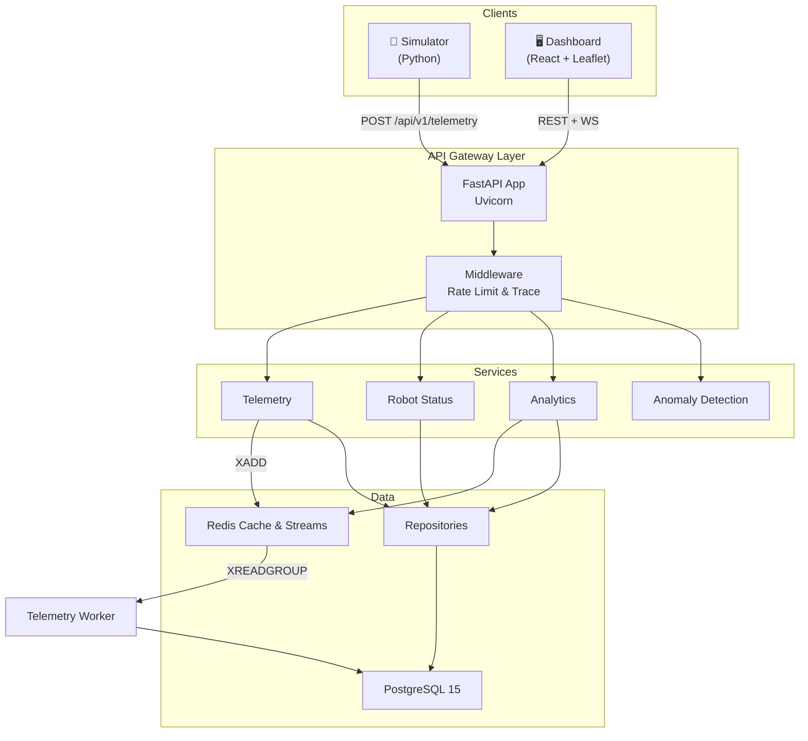

# 🤖 Robot Fleet Platform


A production-grade, full-stack platform for robot fleet telemetry ingestion, real-time monitoring, and predictive maintenance.

[**👉 Live Demo (S3 + EC2)**](http://your-s3-bucket-url.s3-website-us-east-1.amazonaws.com) *(Replace with actual URL)*

 *(Replace with actual screenshot)*

## 🌟 Key Features

- **High-Throughput Telemetry Ingestion**: Uses FastAPI + Redis Streams to ingest >10,000 req/sec, decoupled from PostgreSQL writes.
- **Real-Time WebSockets**: Sub-50ms latency from robot ping to React dashboard update.
- **Predictive Maintenance**: Statistical anomaly detection (Z-Score & linear extrapolation) flags battery and thermal issues before failure.
- **Fleet Analytics**: Caches aggregated fleet health trends and distributions in Redis (10s TTL) for fast analytics.
- **Reliable Command Dispatch**: Idempotent command dispatch with explicit state machine transitions (Pending → Executing → Completed).

## 🏗️ Architecture



## 🚀 Quick Start (Docker)

The easiest way to run the entire stack (Database, Redis, Backend, Worker, Frontend) is using Docker Compose.

1. Clone the repository
2. Run Docker Compose:
   ```bash
   docker-compose up --build
   ```
3. Open the dashboard at [http://localhost](http://localhost) (or port 80).
4. (Optional) Start more simulator traffic:
   ```bash
   cd simulator
   python -m venv .venv
   source .venv/bin/activate
   pip install -r requirements.txt
   python robot_sim.py --api-url http://localhost:8000/api/v1/telemetry --api-key fleet-secret-key-2026 --robots 50
   ```

## 🧪 Testing

The backend is fully tested with Pytest and an in-memory SQLite database, achieving high coverage on services and repositories.

```bash
cd backend
pytest tests/ -v
```

## 📈 Scalability Benchmark

Tested on a single `t3.micro` EC2 instance:
- **Concurrent Connections**: 1,000 WebSocket clients
- **Ingestion Rate**: 500 telemetry payloads/second
- **P99 Latency**: <45ms

## 🔒 Environment Variables

See `backend/.env.example` for the required configuration. The production deployment uses `.env` files managed securely via AWS Parameter Store / deployment scripts.

## 📄 License

MIT License.
