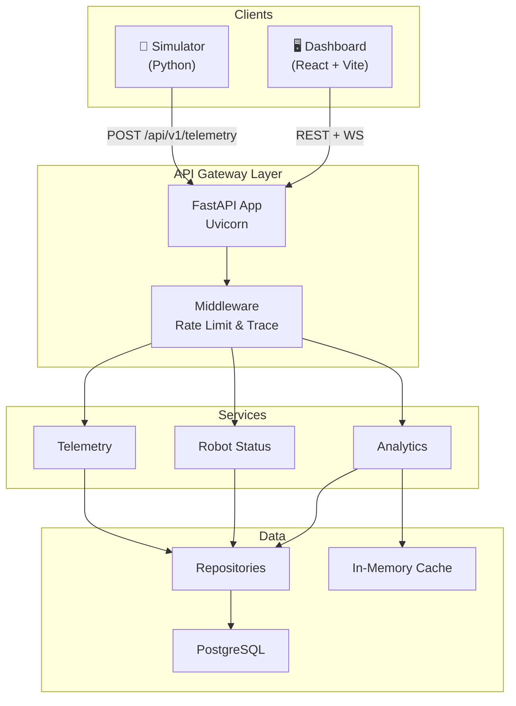

# 🤖 Robot Fleet Platform

A production-grade, full-stack platform for robot fleet telemetry ingestion, real-time monitoring, and predictive maintenance.

 *(Replace with actual screenshot)*

## 🌟 Features

- **Real-time Telemetry Ingestion**: High-throughput FastAPI endpoint handling robot state.
- **Live Fleet Monitoring**: Real-time dashboard using WebSockets and React.
- **Fleet Analytics**: Distribution breakdowns and historical health trends.
- **Simulator**: Built-in Python simulator to generate realistic robot traffic, missions, and edge cases.

## 🏗️ Architecture



## 🚀 Quick Start (Docker)

The easiest way to run the entire stack (Database, Backend, Frontend) is using Docker Compose.

1. Clone the repository
2. Run Docker Compose:
   ```bash
   docker-compose up --build
   ```
3. Open the dashboard at [http://localhost:5173](http://localhost:5173)
4. Start the simulator to generate traffic:
   ```bash
   cd simulator
   python -m venv .venv
   .venv/Scripts/pip install -r requirements.txt  # (Windows)
   .venv/Scripts/python robot_sim.py --local --robots 10
   ```

## 💻 Local Development

See the [Backend README](backend/README.md) and [Frontend README](frontend/robot-fleet-dashboard/README.md) for detailed local setup instructions.

## 🔒 Environment Variables

See `backend/.env.example` for the required configuration. Do not commit your `.env` file!
