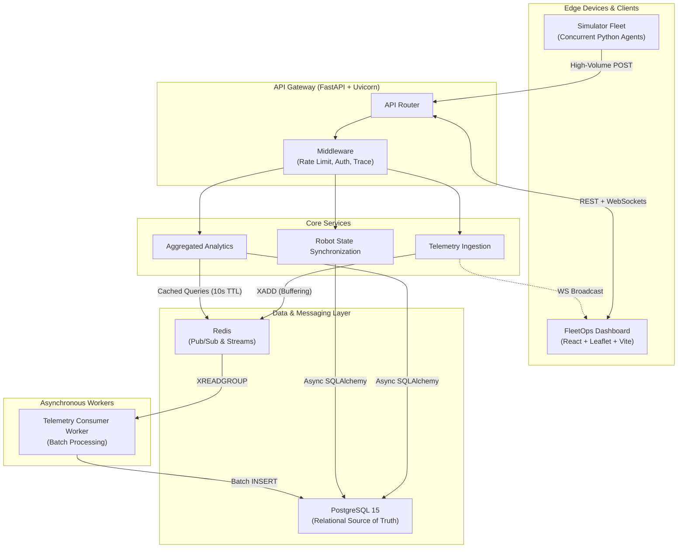
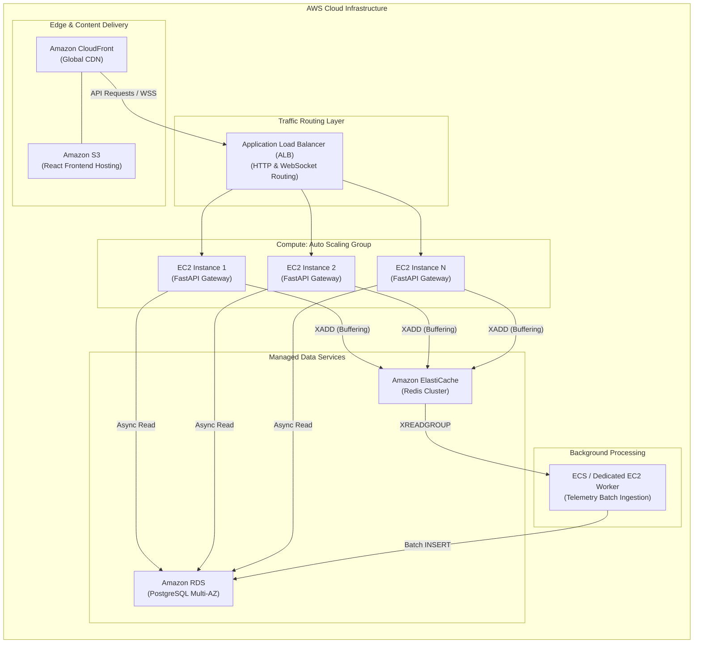

<div align="center">
  <h1>Robot Fleet Telemetry Platform</h1>
  <p><strong>A Distributed, High-Throughput System for Real-Time Telemetry Ingestion and Live Fleet Monitoring</strong></p>
  
  [](https://github.com/placeholder)
  [](https://python.org)
  [](https://reactjs.org/)
  [](https://vitejs.dev/)
  [](https://fastapi.tiangolo.com/)
  [](https://postgresql.org/)
  [](https://redis.io/)
  [](https://prometheus.io/)
  [](https://grafana.com/)
  [](https://docker.com/)
  [](https://aws.amazon.com/)

  [**Live Interactive Demonstration**](http://robot-fleet-dashboard-349627593894.s3-website-us-east-1.amazonaws.com)

</div>

---

## Executive Summary

The **Robot Fleet Telemetry Platform** is a production-grade, distributed web application engineered to address the complexities of high-velocity data ingestion. Designed for scenarios involving thousands of concurrent robotic agents, the platform processes real-time telemetry data, derives live fleet state, and streams it to operator dashboards with low-latency WebSocket synchronization.

This project was developed to demonstrate proficiency in scalable system design, asynchronous event-driven architectures, and modern full-stack development methodologies.

## Engineering Challenges and Solutions

### 1. High-Throughput Asynchronous Ingestion Pipeline
*   **Challenge:** Traditional synchronous relational database writes become a critical bottleneck when ingesting telemetry data from thousands of concurrent agents.
*   **Solution:** Implemented **Redis Streams** as an intermediate, high-speed persistent buffer. The FastAPI ingestion layer handles concurrent `POST` requests, appends payloads to the Redis Stream (`XADD`), and returns immediate HTTP 200 responses. A decoupled background worker asynchronously consumes the stream in micro-batches (`XREADGROUP`) and executes optimized `INSERT` transactions into PostgreSQL, completely decoupling the HTTP request lifecycle from disk I/O latency.

### 2. Real-Time State Synchronization via WebSockets
*   **Challenge:** Polling the server for live geolocation and metric updates degrades performance and introduces unacceptable latency for a live monitoring dashboard.
*   **Solution:** Engineered a WebSocket broadcasting service backed by Redis Streams so every stateless API instance receives and fans out the same live feed. Each client connection gets a bounded outbound queue drained by a dedicated sender task, with drop-oldest backpressure so a slow consumer sheds stale frames instead of stalling the broadcast loop. The React front-end coalesces incoming updates and commits them in throttled 10 Hz batches, keeping the dashboard smooth under a high-frequency stream.

### 3. Idempotent Command Dispatch
*   **Challenge:** Network instability between the server and edge devices can result in duplicate command executions (e.g., redundant "Return to Base" directives).
*   **Solution:** Designed an idempotent command dispatch protocol utilizing explicit state machine transitions (Pending → Executing → Completed). The system guarantees exactly-once execution semantics regardless of network retries.

---

## System Architecture

The application adopts a Microservices-inspired API Gateway architecture, strictly separating the high-velocity ingestion path from the read-heavy analytical path.



---

## AWS Production Cloud Architecture

To guarantee high availability, fault tolerance, and horizontal scalability during extreme traffic spikes, the platform is designed to be deployed across a robust AWS ecosystem utilizing Elastic Load Balancing and Managed Data Services.



### AWS Architectural Enhancements

*   **Elastic Load Balancing (ALB):** Distributes incoming HTTP requests and maintains persistent WebSocket connections across multiple backend instances, preventing any single node from being overwhelmed.
*   **Horizontal Scaling (Auto Scaling Groups):** The FastAPI gateways are stateless. CPU or network triggers automatically provision additional EC2 instances to absorb unexpected spikes in robot telemetry.
*   **Managed Persistence (RDS Multi-AZ):** PostgreSQL is hosted on Amazon RDS with Multi-AZ deployments for automated failover, daily snapshots, and high availability.
*   **High-Throughput Caching (ElastiCache):** Replaces the localized Redis container with a managed ElastiCache cluster, guaranteeing microsecond latency for the Pub/Sub broadcasting and telemetry buffering.
*   **Edge Delivery (S3 + CloudFront):** The React SPA is statically compiled and hosted on S3, distributed globally via CloudFront to ensure minimal load times for fleet operators worldwide.

---

## Scalability and Load Testing

Because telemetry writes are decoupled via Redis Streams, the primary performance constraint shifts from database I/O to CPU scheduling for the WebSocket broadcast fan-out. The numbers below come from the bundled suite ([`scripts/stress_test.py`](./scripts/stress_test.py)) run against the full Docker Compose stack on a single developer machine (Docker Desktop / WSL2) while the simulator was also generating live traffic. They are reproducible, not aspirational — treat them as a single-node lower bound, since the API tier is stateless and scales horizontally behind a load balancer.

**Real-time broadcast fan-out (the headline result):**

| Concurrent WS clients | Connection failures | Messages delivered (10s) | Fan-out throughput |
| :--- | :--- | :--- | :--- |
| 500 | 0 | 67,692 | ~6,800 msg/s |
| 1,500 | 0 | 171,331 | ~17,100 msg/s |
| **2,000** | **0** | **177,957** | **~17,800 msg/s** |

Every client received the live feed with zero dropped connections, validating the bounded-queue-per-connection design.

**HTTP request latency (single node):**

| Ingest concurrency | Success | p50 | p99 |
| :--- | :--- | :--- | :--- |
| 1 | 100% | 8 ms | 16 ms |
| 10 | 100% | 62 ms | 63 ms |
| 50 | 100% | 219 ms | 375 ms |

A 30-second sustained mixed-load run (POST ingest + status/analytics reads at concurrency 50) completed **2,870 requests with zero failures** at a p50 of ~407 ms.

**Honest limitations (single-node ceiling):** synchronous HTTP throughput plateaus around 125–250 req/s per node and, beyond ~500 simultaneous ingest requests, latency climbs into the multi-second range and the node begins shedding load (HTTP 500s at 1,500–2,000 concurrency). This is the expected saturation point of one stateless instance and is precisely what the horizontal Auto Scaling Group + load balancer design addresses — additional API nodes each drain the same shared Redis stream, so ingest and fan-out capacity scale linearly with node count.

---

## Local Development and Deployment

The easiest way to instantiate the entire ecosystem locally is via Docker. However, for cloud deployment, this repository utilizes **Terraform (Infrastructure as Code)** to automatically provision the robust AWS architecture detailed above.

### Infrastructure as Code (Terraform)
The Terraform configuration (`terraform/main.tf`) is fully parameterized and strictly configured by default to utilize **AWS Free Tier** resources (`t3.micro` ASG, Single-AZ RDS, Single-Node ElastiCache) to prevent unexpected billing. It can be instantly scaled to an enterprise production environment by modifying `variables.tf`.

To provision the AWS Cloud Infrastructure:
```powershell
cd scripts
.\deploy_terraform.ps1
```

### Local Docker Deployment
1. **Repository Configuration**
```bash
git clone https://github.com/your-username/robot-fleet-platform.git
cd robot-fleet-platform
```

2. **Launch the Stack**
```bash
# Builds the frontend, backend, and simulator, while provisioning Postgres and Redis containers
docker-compose up --build -d
```

### 3. Access the Services
*   **Web Dashboard:** `http://localhost` (Port 80)
*   **FastAPI Swagger UI:** `http://localhost:8000/docs`
*   **Grafana Metrics:** `http://localhost:3000` (Credentials: admin/admin)

### 4. Stress Testing Suite
The repository includes a dedicated stress testing script to benchmark local or cloud deployments.
```bash
pip install aiohttp
python scripts/stress_test.py --base-url http://localhost:8000
```

---

## Repository Structure

| Directory | Description |
| :--- | :--- |
| [`/backend`](./backend) | FastAPI application, SQLAlchemy ORM models, Alembic migrations, and the decoupled Redis worker. |
| [`/frontend`](./frontend) | React 18, Vite, Recharts, and Leaflet.js dashboard source code. |
| [`/simulator`](./simulator) | High-performance asynchronous Python script simulating thousands of robotic agents with physical states (battery degradation, thermal physics, dynamic routing). |
| [`/scripts`](./scripts) | Continuous Integration deployment scripts, AWS EC2 provisioning automations, and rigorous load testing tools. |

---

## License
This project is licensed under the MIT License.
