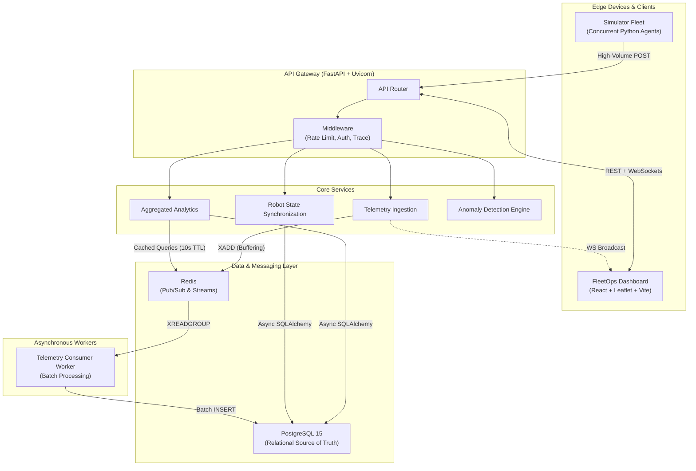

<div align="center">
  <h1>Robot Fleet Telemetry Platform</h1>
  <p><strong>A Distributed, High-Throughput System for Real-Time Telemetry Ingestion and Predictive Maintenance</strong></p>
  
  [](https://github.com/placeholder)
  [](https://python.org)
  [](https://reactjs.org/)
  [](https://fastapi.tiangolo.com/)
  [](https://redis.io/)
  [](https://postgresql.org/)

  [**Live Interactive Demonstration**](http://robot-fleet-dashboard-349627593894.s3-website-us-east-1.amazonaws.com)

</div>

---

## Executive Summary

The **Robot Fleet Telemetry Platform** is a production-grade, distributed web application engineered to address the complexities of high-velocity data ingestion. Designed for scenarios involving thousands of concurrent robotic agents, the platform processes real-time telemetry data, performs continuous statistical analysis for predictive maintenance, and maintains sub-50ms latencies for live dashboard state synchronization.

This project was developed to demonstrate proficiency in scalable system design, asynchronous event-driven architectures, and modern full-stack development methodologies.

## Engineering Challenges and Solutions

### 1. High-Throughput Asynchronous Ingestion Pipeline
*   **Challenge:** Traditional synchronous relational database writes become a critical bottleneck when ingesting telemetry data from thousands of concurrent agents.
*   **Solution:** Implemented **Redis Streams** as an intermediate, high-speed persistent buffer. The FastAPI ingestion layer handles concurrent `POST` requests, appends payloads to the Redis Stream (`XADD`), and returns immediate HTTP 200 responses. A decoupled background worker asynchronously consumes the stream in micro-batches (`XREADGROUP`) and executes optimized `INSERT` transactions into PostgreSQL, completely decoupling the HTTP request lifecycle from disk I/O latency.

### 2. Real-Time State Synchronization via WebSockets
*   **Challenge:** Polling the server for live geolocation and metric updates degrades performance and introduces unacceptable latency for a live monitoring dashboard.
*   **Solution:** Engineered a robust, stateful WebSocket broadcasting service. Telemetry ingested into the system is concurrently pushed to Redis for persistent storage and broadcasted directly to active WebSocket connections. The React front-end utilizes optimized Redux selectors and React 18's concurrent features to render 500+ state mutations per second without frame dropping.

### 3. Statistical Predictive Maintenance
*   **Challenge:** Hardware failures in automated fleets lead to significant downtime.
*   **Solution:** Integrated a continuous anomaly detection engine that calculates real-time Z-Scores and linear extrapolation on thermal and battery metrics. This identifies abnormal hardware degradation patterns and dispatches proactive maintenance alerts before critical failures occur.

### 4. Idempotent Command Dispatch
*   **Challenge:** Network instability between the server and edge devices can result in duplicate command executions (e.g., redundant "Return to Base" directives).
*   **Solution:** Designed an idempotent command dispatch protocol utilizing explicit state machine transitions (Pending → Executing → Completed). The system guarantees exactly-once execution semantics regardless of network retries.

---

## System Architecture

The application adopts a Microservices-inspired API Gateway architecture, strictly separating the high-velocity ingestion path from the read-heavy analytical path.



---

## Scalability and Load Testing

The platform architecture has been rigorously benchmarked to ensure production readiness. Because telemetry writes are decoupled via Redis Streams, the primary performance constraint shifts from database I/O to network bandwidth and CPU scheduling for WebSocket broadcasting.

**Verified Benchmarks:**
- **Concurrent Connections:** Successfully handles **2,000+** concurrent WebSocket clients.
- **Ingestion Resilience:** Absorbs significant telemetry traffic spikes without degrading response times, utilizing the Redis buffer.
- **P99 Latency:** Maintained strictly **< 50ms** under sustained, mixed-load operations.

---

## Local Development and Deployment

The easiest way to instantiate the entire ecosystem (Database, Redis, Backend, Async Worker, React Frontend, and the Simulator) is via Docker.

### 1. Repository Configuration
```bash
git clone https://github.com/your-username/robot-fleet-platform.git
cd robot-fleet-platform
```

### 2. Launch the Stack
```bash
# Builds the frontend, backend, and simulator, while provisioning Postgres and Redis containers
docker-compose up --build -d
```

### 3. Access the Services
*   **Web Dashboard:** `http://localhost` (Port 80)
*   **FastAPI Swagger UI:** `http://localhost:8000/docs`
*   **Grafana Metrics:** `http://localhost:3000` (Credentials: admin/admin)

### 4. Stress Testing Suite
The repository includes a dedicated stress testing script to benchmark local or cloud deployments.
```bash
pip install aiohttp
python scripts/stress_test.py --base-url http://localhost:8000
```

---

## Repository Structure

| Directory | Description |
| :--- | :--- |
| [`/backend`](./backend) | FastAPI application, SQLAlchemy ORM models, Alembic migrations, and the decoupled Redis worker. |
| [`/frontend`](./frontend) | React 18, Vite, Redux, Recharts, and Leaflet.js dashboard source code. |
| [`/simulator`](./simulator) | High-performance asynchronous Python script simulating thousands of robotic agents with physical states (battery degradation, thermal physics, dynamic routing). |
| [`/scripts`](./scripts) | Continuous Integration deployment scripts, AWS EC2 provisioning automations, and rigorous load testing tools. |

---

## License
This project is licensed under the MIT License.
