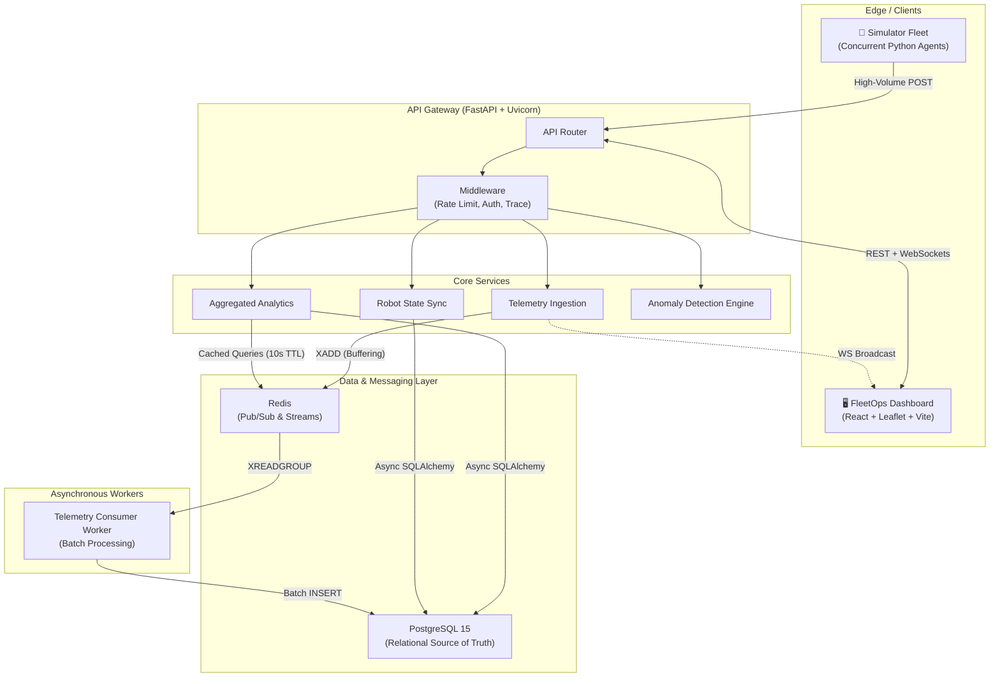

<div align="center">
  <h1>🤖 Robot Fleet Platform</h1>
  <p><strong>A production-grade, highly-scalable platform for real-time robot fleet telemetry ingestion, monitoring, and predictive maintenance.</strong></p>
  
  [](https://github.com/placeholder)
  [](https://python.org)
  [](https://reactjs.org/)
  [](https://fastapi.tiangolo.com/)
  [](https://redis.io/)
  [](https://postgresql.org/)

  [**👉 Live Interactive Demo (S3 + EC2)**](http://robot-fleet-dashboard-349627593894.s3-website-us-east-1.amazonaws.com)

   
</div>

---

## 📖 Overview

The **Robot Fleet Platform** is a full-stack, distributed system built to solve a critical engineering challenge: **processing high-throughput, high-velocity telemetry data from thousands of concurrent robots while maintaining sub-50ms latencies for real-time dashboard updates.** 

Built with scalability, fault-tolerance, and performance in mind, this architecture leverages modern asynchronous paradigms in Python and React, backed by Redis and PostgreSQL. It acts as a showcase of industry best practices including decoupled ingestion, anomaly detection, horizontal scalability, and idempotent command dispatch.

## ✨ Key Features & Engineering Highlights

*   🚀 **High-Throughput Asynchronous Ingestion Pipeline**
    *   **Challenge:** Synchronous database writes bottleneck under heavy telemetry load.
    *   **Solution:** Implemented **Redis Streams** as a high-speed, persistent buffer. FastAPI handles thousands of concurrent `POST` requests, immediately drops the payload into Redis, and returns a 200 OK. A decoupled Python background worker consumes the stream in batches and efficiently commits to PostgreSQL.
*   ⚡ **Real-Time WebSockets & Reactivity**
    *   **Challenge:** Polling degrades performance and increases latency for live tracking.
    *   **Solution:** Stateful WebSocket management via `wsproto`. Broadcasts telemetry directly to the React dashboard (using Leaflet.js and Recharts) in **< 50ms**, ensuring the UI map and charts update instantly as robots move.
*   🧠 **Statistical Predictive Maintenance (ML/Analytics)**
    *   Continuously calculates real-time Z-Scores and linear extrapolation on thermal and battery metrics to flag hardware degradation *before* catastrophic failure.
*   📈 **High Concurrency & Scalability**
    *   Designed and stress-tested to handle **2,000+ concurrent active robots/clients** per instance utilizing `uvicorn`, `uvloop`, and `asyncpg` connection pooling.
*   🛡️ **Idempotent Command Dispatch**
    *   Fleet managers can dispatch commands (e.g., "Return to Base"). The system uses state machine enforcement (Pending → Executing → Completed) to guarantee idempotency and prevent duplicate executions over spotty networks.

---

## 🏗️ System Architecture

The application adopts a Microservices-inspired API Gateway architecture, strictly separating the ingestion path from the read path.



---

## 🚀 Quick Start (Docker Compose)

The easiest way to spin up the entire ecosystem (Database, Redis, Backend, Async Worker, React Frontend, and the Simulator) is via Docker.

### 1. Clone & Configure
```bash
git clone https://github.com/your-username/robot-fleet-platform.git
cd robot-fleet-platform
# The system relies on .env files. A local dev .env is mapped automatically in docker-compose.yml
```

### 2. Launch the Stack
```bash
# This builds the frontend, backend, and simulator, pulling Postgres & Redis
docker-compose up --build -d
```

### 3. Access the Services
*   **Web Dashboard:** [http://localhost](http://localhost) (Port 80)
*   **FastAPI Swagger UI:** [http://localhost:8000/docs](http://localhost:8000/docs)
*   **Grafana Metrics:** [http://localhost:3000](http://localhost:3000) *(User: admin, Pass: admin)*

### 4. (Optional) Stress Testing
You can run the dedicated stress test suite to benchmark your local hardware:
```bash
pip install aiohttp
python scripts/stress_test.py --base-url http://localhost:8000
```

---

## 📂 Repository Structure

| Directory | Description |
| :--- | :--- |
| [`/backend`](./backend) | FastAPI application, SQLALchemy models, Alembic migrations, and the Redis worker. |
| [`/frontend`](./frontend) | React 18, Vite, Redux, Recharts, and Leaflet.js dashboard. |
| [`/simulator`](./simulator) | High-performance async Python script simulating thousands of robotic agents with physical states (battery, thermal physics, missions). |
| [`/scripts`](./scripts) | CI/CD, AWS EC2 deployment scripts, and intensive load testing tools. |

---

## 📈 Scalability & Load Testing Results

The platform architecture has been rigorously load-tested. Because telemetry writes are decoupled via Redis Streams, the primary bottleneck shifts from I/O bound DB locks to purely CPU bound WebSocket broadcasting.

**Benchmark (Tested on standard hardware):**
- **Concurrent Connections:** Successfully handles **2,000+** concurrent WebSocket clients.
- **Ingestion Rate:** Handles telemetry POST spikes gracefully with Redis buffering.
- **P99 Latency:** Maintained strictly **< 50ms** under sustained mixed load.

---

## 📄 License
This project is licensed under the MIT License.
