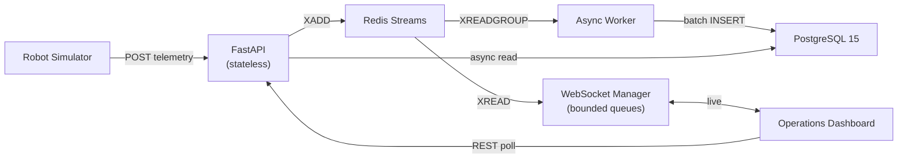

<div align="center">

# Real-Time Robot Fleet Monitoring and Control Platform

**A distributed, event-driven system for real-time telemetry ingestion, live monitoring, and bidirectional control of a robot fleet.**

[](https://github.com/colin-110/robot-fleet-platform/actions)
[](https://python.org)
[](https://fastapi.tiangolo.com/)
[](https://reactjs.org/)
[](https://postgresql.org/)
[](https://redis.io/)
[](https://aws.amazon.com/)
[](./LICENSE)

### **[▶ Live Demo](https://d14zlr0p01xdp8.cloudfront.net)**


</div>

---

## Overview

Forty simulated robots stream high-frequency telemetry — battery, temperature, speed, position, per-component health, mission progress — into a backend that ingests it, derives live fleet state, and pushes updates to an operator dashboard over WebSockets. Operators dispatch commands back to individual robots (Return to Base, Emergency Stop, Resume) through an idempotent state machine.

The write path and the read path are deliberately separated. An ingest request returns as soon as it has appended to a Redis Stream; a decoupled worker batches those entries into PostgreSQL. Request latency is therefore independent of database I/O, and the same stream feeds WebSocket fan-out to every connected dashboard.

**Measured on a single node:** 2,000 concurrent WebSocket clients at ~15,000–18,000 msg/s with >99% delivery. Ingest p99 fell from 1,271 ms to 158 ms once the Redis buffer replaced synchronous inserts.

| Layer | Technologies |
| :--- | :--- |
| Frontend | React 19, Vite, React-Leaflet, Recharts, native WebSocket, Axios |
| Backend | FastAPI (async), Uvicorn, SQLAlchemy 2.0 (async), Pydantic v2 |
| Data and messaging | PostgreSQL 15, Redis 7 (Streams with consumer groups) |
| Async processing | Dedicated worker (batch inserts, retention pruning, command timeouts) |
| Observability | Prometheus (multiprocess-aware), Grafana |
| Infrastructure | Docker Compose, GitHub Actions, GHCR, AWS (EC2, RDS, ElastiCache, CloudFront) |

---

## Architecture


```mermaid
graph LR
  SIM["Robot Simulator"] -->|"POST telemetry"| API["FastAPI<br/>(stateless)"]
  API -->|"XADD"| REDIS["Redis Streams"]
  REDIS -->|"XREADGROUP"| WORKER["Async Worker"]
  REDIS -->|"XREAD"| WS["WebSocket Manager<br/>(bounded queues)"]
  WORKER -->|"batch INSERT"| PG["PostgreSQL 15"]
  API -->|"async read"| PG
  WS <-->|"live"| DASH["Operations Dashboard"]
  DASH -->|"REST poll"| API
```

The two Redis read modes are the design's hinge. The worker uses `XREADGROUP`, so consumer-group members split the stream and each row is persisted exactly once. Fan-out uses `XREAD`, so every API instance sees every message and forwards it to its own clients. The API holds no per-request state, so adding instances scales both ingest and fan-out.

**→ [Full architecture and engineering highlights](./docs/architecture.md)** — the roster design that makes robot *absence* detectable, device-reported timestamps for store-and-forward, compare-and-set command transitions, and multiprocess-correct metrics.

---

## Performance

Every optimization sits behind an `OPT_*` flag whose "off" state restores the implementation it replaced. The benchmark harness uses that to measure each one **in isolation** rather than reporting an everything-on/everything-off number that cannot attribute the gain.

| Optimization | Baseline it replaces | Metric | Baseline | Optimized | Change |
| :--- | :--- | :--- | ---: | ---: | ---: |
| Redis read-through cache (fleet status) | Recompute window-function query per request | p99 | 11,172 ms | 265 ms | **-97.6%** |
| Redis Stream ingest buffer | Synchronous `INSERT` on the request path | p99 | 1,271 ms | 158 ms | **-87.6%** |
| Pure ASGI middleware | Starlette `BaseHTTPMiddleware` | p99 | 176 ms | 89 ms | **-49.5%** |
| Worker bulk `INSERT` | One `INSERT` + `COMMIT` per row | throughput | 242 rows/s | 985 rows/s | **+308%** |
| Bounded-queue WebSocket fan-out | `create_task` per client per message | throughput | 5,977 msg/s | 14,352 msg/s | **+140%** |

Arms are interleaved so host load biases both equally; the harness asserts via `/health` that the flags actually came up, and rejects any arm where more than 5% of requests failed — because the p99 of zero successful requests is `0.0`, which otherwise reads as infinitely fast. Two experiments initially reported wrong numbers and are [documented along with how the harness caught them](./docs/performance.md#on-measurement-error).

**→ [Full benchmarks, methodology, and load tests](./docs/performance.md)**

---

## Testing

| | Tests | Coverage | Environment |
| :--- | ---: | ---: | :--- |
| Backend (pytest) | 171 | 76% | Real PostgreSQL + Redis |
| Frontend (vitest) | 69 | 88% hooks, 100% utils | jsdom |

The backend suite runs against real PostgreSQL rather than SQLite because the application depends on Postgres-specific SQL — `date_trunc`, `INTERVAL` arithmetic, and atomic conditional `UPDATE` dispatch — that SQLite cannot execute. A safety guard refuses to run against any database whose name does not contain `test`, since the fixtures drop and recreate the schema between tests.

**Covered:** telemetry ingestion and retrieval; fleet-status derivation; the full command lifecycle including terminal-state immutability, idempotency keys, timeouts, and concurrent dispatch (two racing `PATCH` requests must not both commit); analytics aggregation; cache hit and bypass; worker batch parsing, drain/ack cycle, backoff, and clean cancellation; WebSocket sender teardown, bounded-queue overflow, and Redis listener recovery; ticket auth — that a holder cannot forge, widen its scope, or extend its own expiry; and JWT sign-in, covering role ranking, `alg: none` and wrong-key rejection, username enumeration via error message or timing, and that bootstrapping the first admin cannot overwrite an existing one. On the frontend: WebSocket reconnect and unmount safety, poll-and-prune roster reconciliation, 10 Hz update coalescing, ticket caching, command dispatch, and the sign-in gate.

**Not covered:** presentational React components, which is why the frontend's all-files number is lower than its hooks number. Coverage is honest rather than uniform.

---

## Running Locally

**Prerequisites:** Docker and Docker Compose.

```bash
git clone https://github.com/colin-110/robot-fleet-platform.git
cd robot-fleet-platform
cp backend/.env.example backend/.env
```

Set a database password and an API key in `backend/.env`. The application refuses to start without `TELEMETRY_API_KEY` — there is no fallback default. Generate one with:

```bash
python -c "import secrets; print(secrets.token_urlsafe(32))"
```

```bash
docker compose up --build -d
```

| Service | URL |
| :--- | :--- |
| Dashboard | http://localhost |
| API documentation (Swagger) | http://localhost:8000/docs |
| Prometheus | http://localhost:9090 |
| Grafana | http://localhost:3000 (admin/admin) |

Run the test suites:

```bash
cd backend && pytest tests/ -v --cov=app
```

```bash
cd frontend/robot-fleet-dashboard && npm run test:coverage
```

**→ [Configuration, deployment, security posture, and scaling roadmap](./docs/operations.md)**

---

## Limitations

Being direct about where this stands is more useful than overselling it.

| Area | Limitation |
| :--- | :--- |
| HTTP throughput | Single-node ingest plateaus around 125–250 req/s. Beyond ~500 concurrent requests the node sheds load. The Redis buffer helps substantially; the FastAPI request path remains the ceiling. Addressed by horizontal scaling. |
| Authentication | JWT sign-in with ranked roles exists and is enforced, but the **hosted demo deliberately runs `AUTH_MODE=open`** so the link is clickable — meaning anyone who loads it can drive the fleet. Any deployment with real data sets `AUTH_MODE=required`, which production defaults to. Still missing: multi-tenancy, per-fleet isolation, and an external IdP (OIDC) rather than local accounts. |
| No high availability | One EC2 instance, single-AZ RDS, one Redis node. A node or AZ failure means downtime. |
| Bounded ingest buffer | The Redis Stream is capped and Redis trims the oldest beyond that, including entries the worker has not acknowledged. Made visible rather than silent: `telemetry_stream_length` and `telemetry_stream_pending` are exported and the worker warns at 90%. A durable fix means a dead-letter path or a disk-backed broker. |
| Time-series storage | Telemetry lives in a plain PostgreSQL table bounded by a daily retention pruner. Works, but not ideal at volume. |
| Simulator in production | The live deployment runs the simulator to generate demonstration data. A real system ingests from actual devices. |

---

## License

MIT. See [LICENSE](./LICENSE).
