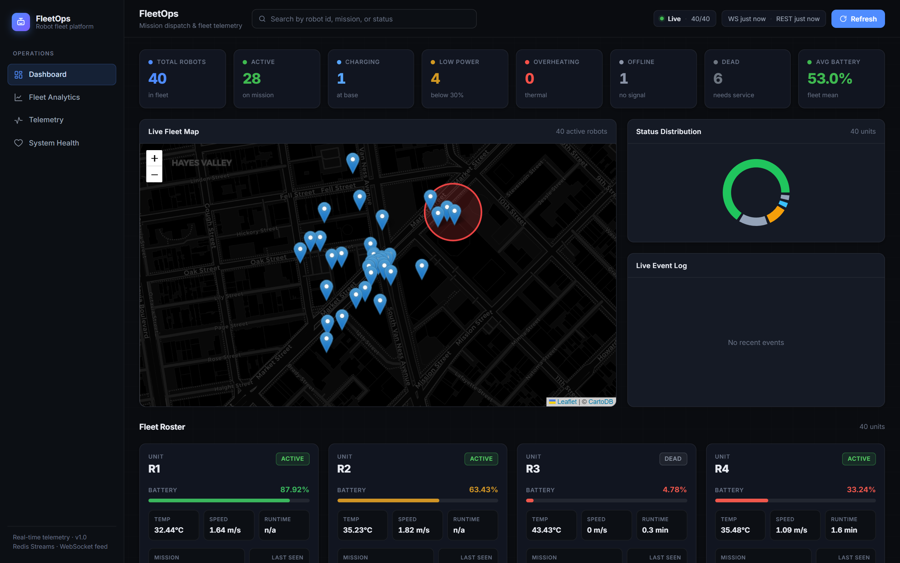
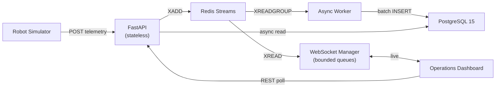

<div align="center">

# Real-Time Robot Fleet Monitoring and Control Platform

**A distributed, event-driven system for real-time telemetry ingestion, live monitoring, and bidirectional control of a robot fleet.**

[](https://github.com/colin-110/robot-fleet-platform/actions)
[](https://python.org)
[](https://fastapi.tiangolo.com/)
[](https://reactjs.org/)
[](https://postgresql.org/)
[](https://redis.io/)
[](https://aws.amazon.com/)
[](./LICENSE)

### **[▶ Live Demo](https://d14zlr0p01xdp8.cloudfront.net)**



</div>

---

## Overview

A simulated robot fleet streams high-frequency telemetry — battery, temperature, speed, position, per-component health, mission progress — into a backend that ingests it, derives live fleet state, and pushes updates to an operator dashboard over WebSockets. Operators dispatch commands back to individual robots (Return to Base, Emergency Stop, Resume) through an idempotent state machine.

**The central design decision is that the write path and the read path are separate.** An ingest request returns as soon as it has appended to a Redis Stream; a decoupled worker batches those entries into PostgreSQL. Request latency is therefore independent of database I/O, and the same stream feeds WebSocket fan-out to every connected dashboard.

Measured on a single node: **2,000 concurrent WebSocket clients at ~15,000–18,000 msg/s** with >99% delivery, and ingest p99 down from **1,271 ms to 158 ms** once the Redis buffer replaced synchronous inserts. Every one of those numbers comes from a harness that measures one variable at a time — see [Performance](#performance).

| Layer | Technologies |
| :--- | :--- |
| Frontend | React 19, Vite, React-Leaflet, Recharts, native WebSocket, Axios |
| Backend | FastAPI (async), Uvicorn, SQLAlchemy 2.0 (async), Pydantic v2 |
| Data and messaging | PostgreSQL 15, Redis 7 (Streams with consumer groups) |
| Async processing | Dedicated worker (batch inserts, retention pruning, command timeouts) |
| Auth | HMAC console tickets, JWT (HS256) with ranked roles, bcrypt |
| Observability | Structured JSON logging with request correlation, Prometheus (multiprocess-aware), Grafana |
| Infrastructure | Docker Compose, GitHub Actions, GHCR, AWS (EC2, RDS, ElastiCache, CloudFront) |

---

## Key Features

- **Decoupled ingestion.** HTTP writes return after a single Redis `XADD`; a worker batches them into PostgreSQL, so request latency never waits on disk.
- **Real-time fan-out that survives slow clients.** Bounded per-client queues drained by one sender task each. On overflow the *oldest* frame is dropped — stale telemetry is worthless, and one stalled client must not back-pressure the fleet.
- **Absence is detectable.** Fleet state is the robot roster `LEFT JOIN`ed onto recent telemetry, not a `GROUP BY` over telemetry. A unit that stops reporting renders `OFFLINE` instead of silently vanishing.
- **Idempotent command dispatch.** An explicit state machine where every transition is an atomic compare-and-set `UPDATE`, so racing writers cannot both commit.
- **Layered auth.** The browser never holds the master key — it gets a short-lived scoped ticket. Operator identity is a separate JWT layer, enabled by configuration.
- **Measured optimizations.** Each one sits behind a feature flag whose off-state is the implementation it replaced, so its contribution is measured in isolation rather than assumed.
- **Correlated structured logging.** Every line carries the request id the caller was handed back, so a reported `X-Request-ID` is findable. JSON in production; one access line per request, because uvicorn's own is disabled there.
- **Blocking CI/CD.** Lint, 257 tests, and a production build all gate the pipeline; passing builds publish versioned images to GHCR that the host pulls.

---

## Architecture


```mermaid
graph LR
  SIM["Robot Simulator"] -->|"POST telemetry"| API["FastAPI<br/>(stateless)"]
  API -->|"XADD"| REDIS["Redis Streams"]
  REDIS -->|"XREADGROUP"| WORKER["Async Worker"]
  REDIS -->|"XREAD"| WS["WebSocket Manager<br/>(bounded queues)"]
  WORKER -->|"batch INSERT"| PG["PostgreSQL 15"]
  API -->|"async read"| PG
  WS <-->|"live"| DASH["Operations Dashboard"]
  DASH -->|"REST poll"| API
```

The two Redis read modes are the design's hinge. The worker uses `XREADGROUP`, so consumer-group members split the stream and each row is persisted exactly once. Fan-out uses `XREAD`, so every API instance sees every message and forwards it to its own clients. The API holds no per-request state, so adding instances scales both ingest and fan-out.

**→ [Full architecture and engineering highlights](./docs/architecture.md)** — the roster design that makes robot *absence* detectable, device-reported timestamps for store-and-forward, compare-and-set command transitions, and multiprocess-correct metrics.

---

## Security

Two layers that answer different questions.

**Console tickets — *may this browser talk to the API?*** A WebSocket handshake cannot carry an `Authorization` header, so the credential has to travel in the URL, where it lands in proxy and access logs. The dashboard therefore requests a ticket at runtime rather than being built with a key: it expires in minutes, carries a scope signed alongside its expiry (so a holder can neither widen its permissions nor extend its life), and **cannot ingest telemetry**. The master key stays server-side, so reading the JavaScript bundle no longer yields a credential that can forge readings for the whole fleet.

**JWT — *who is this operator?*** `AUTH_MODE=required` puts every console action behind a bcrypt-verified sign-in and an HS256 token carrying a signed role: `viewer` reads, `operator` dispatches commands, `admin` covers both. Production defaults to required.

The hosted demo runs `AUTH_MODE=open` deliberately — a login wall on a portfolio deployment means nobody clicks past it, and the data is synthetic. Open mode does not *skip* the check; it resolves every caller to an anonymous operator through the same dependency. One code path, so the authenticated branch is exercised by ordinary traffic instead of only in an environment nobody tests.

Also: constant-time key comparison, `X-Forwarded-For` resolved by trusted-proxy count (trusting the leftmost entry lets a client spoof its own address), separate rate-limit budgets for fleet ingest and browser-reachable endpoints, and a login that returns one message *and one timing profile* for both "no such user" and "wrong password" so it cannot enumerate accounts.

**→ [Full security posture](./docs/operations.md#security-posture)**

---

## Performance

Every optimization sits behind an `OPT_*` flag whose "off" state restores the implementation it replaced. The benchmark harness uses that to measure each one **in isolation** rather than reporting an everything-on/everything-off number that cannot attribute the gain.

| Optimization | Baseline it replaces | Metric | Baseline | Optimized | Change |
| :--- | :--- | :--- | ---: | ---: | ---: |
| Redis read-through cache (fleet status) | Recompute window-function query per request | p99 | 11,172 ms | 265 ms | **-97.6%** |
| Redis Stream ingest buffer | Synchronous `INSERT` on the request path | p99 | 1,271 ms | 158 ms | **-87.6%** |
| Pure ASGI middleware | Starlette `BaseHTTPMiddleware` | p99 | 176 ms | 89 ms | **-49.5%** |
| Worker bulk `INSERT` | One `INSERT` + `COMMIT` per row | throughput | 242 rows/s | 985 rows/s | **+308%** |
| Bounded-queue WebSocket fan-out | `create_task` per client per message | throughput | 5,977 msg/s | 14,352 msg/s | **+140%** |

Arms are interleaved so host load biases both equally; the harness asserts via `/health` that the flags actually came up, and rejects any arm where more than 5% of requests failed — because the p99 of zero successful requests is `0.0`, which otherwise reads as infinitely fast.

Two experiments initially reported wrong numbers. Both are [written up along with how the harness caught them](./docs/performance.md#on-measurement-error), because that is the failure mode the harness exists to prevent.

**→ [Full benchmarks, methodology, and load tests](./docs/performance.md)**

---

## Testing

| | Tests | Coverage | Environment |
| :--- | ---: | ---: | :--- |
| Backend (pytest) | 188 | 76% | Real PostgreSQL + Redis |
| Frontend (vitest) | 69 | 88% hooks, 100% utils | jsdom |

The backend suite runs against real PostgreSQL rather than SQLite because the application depends on Postgres-specific SQL — `date_trunc`, `INTERVAL` arithmetic, and atomic conditional `UPDATE` dispatch — that SQLite cannot execute. A safety guard refuses to run against any database whose name does not contain `test`, since the fixtures drop and recreate the schema between tests.

**Covered.** Telemetry ingestion on *both* the buffered and direct paths; fleet-status derivation; the full command lifecycle including terminal-state immutability, idempotency keys, timeouts, and concurrent dispatch; the timeout scanner's compare-and-set, driven by a second connection committing mid-scan so the race is real rather than simulated; worker drain/ack, backoff, and clean cancellation; WebSocket sender teardown, bounded-queue overflow, and listener recovery; ticket forgery, scope-widening, and expiry extension; JWT role ranking, `alg: none` and wrong-key rejection, and account enumeration by message or timing. On the frontend: WebSocket reconnect and unmount safety, poll-and-prune roster reconciliation, 10 Hz update coalescing, ticket caching, command dispatch, and the sign-in gate. Logging is covered too: request-id isolation across concurrent tasks, JSON field emission, and that an inbound `X-Request-ID` survives into the access line.

**Not covered.** Presentational React components, which is why the frontend's all-files number is lower than its hooks number. Coverage is honest rather than uniform.

---

## Running Locally

**Prerequisites:** Docker and Docker Compose.

```bash
git clone https://github.com/colin-110/robot-fleet-platform.git
cd robot-fleet-platform
cp backend/.env.example backend/.env
```

Set a database password and an API key in `backend/.env`. The application refuses to start without `TELEMETRY_API_KEY` — there is no fallback default. Generate one with:

```bash
python -c "import secrets; print(secrets.token_urlsafe(32))"
```

```bash
docker compose up --build -d
```

That brings up the API, worker, dashboard, a 40-robot simulator, PostgreSQL, Redis, Prometheus, and Grafana.

| Service | URL |
| :--- | :--- |
| Dashboard | http://localhost |
| API documentation (Swagger) | http://localhost:8000/docs |
| Prometheus | http://localhost:9090 |
| Grafana | http://localhost:3000 (admin/admin) |

### Tests

The backend suite needs its own database. The dev compose publishes PostgreSQL on `5432`, so create one and point `DATABASE_URL` at it — the name must contain `test` or the fixtures refuse to run:

```bash
docker compose exec db createdb -U postgres fleet_test_db
```

```bash
cd backend && DATABASE_URL=postgresql://postgres:<your-password>@localhost:5432/fleet_test_db pytest tests/ -v --cov=app
```

The frontend suite needs Node 22.22+ or 24.15+ (jsdom 30's engine floor) and no services at all:

```bash
cd frontend/robot-fleet-dashboard && npm ci && npm run test:coverage
```

---

## Deployment

A single `t3.micro` EC2 instance runs the stack via Docker Compose, backed by managed RDS and ElastiCache, behind CloudFront for HTTPS.

The host **pulls pre-built images from GHCR rather than building.** CI builds them on every push to `main` and publishes only after the tests pass, so what ships is what was verified. `IMAGE_TAG` defaults to `latest` but takes a commit SHA, giving each deploy a name and a rollback target.

```bash
IMAGE_TAG=<sha> docker compose -f docker-compose.aws.yml -p fleetops pull
IMAGE_TAG=<sha> docker compose -f docker-compose.aws.yml -p fleetops up -d
```

**→ [Configuration, deployment, security posture, and scaling roadmap](./docs/operations.md)**

---

## Repository Structure

| Path | Contents |
| :--- | :--- |
| [`backend/app/`](./backend/app) | FastAPI routes → services → repositories, async SQLAlchemy models, the Redis-to-PostgreSQL worker, auth, and metrics |
| [`backend/tests/`](./backend/tests) | Pytest suite against real PostgreSQL |
| [`frontend/robot-fleet-dashboard/`](./frontend/robot-fleet-dashboard) | React 19 + Vite dashboard (Leaflet map, Recharts, WebSocket hooks), served by nginx |
| [`simulator/`](./simulator) | Async physics-based robot agents |
| [`scripts/`](./scripts) | A/B benchmark harness and load-test tooling |
| [`docs/`](./docs) | Architecture, performance, and operations detail |

---

## Limitations

Being direct about where this stands is more useful than overselling it.

| Area | Limitation |
| :--- | :--- |
| HTTP throughput | Single-node ingest plateaus around 125–250 req/s. Beyond ~500 concurrent requests the node sheds load. The Redis buffer helps substantially; the FastAPI request path remains the ceiling. Addressed by horizontal scaling. |
| Authentication | JWT sign-in with ranked roles exists and is enforced, but the **hosted demo deliberately runs `AUTH_MODE=open`** so the link is clickable — meaning anyone who loads it can drive the fleet. Any deployment with real data sets `AUTH_MODE=required`, which production defaults to. Still missing: multi-tenancy, per-fleet isolation, and an external IdP (OIDC) rather than local accounts. |
| No high availability | One EC2 instance, single-AZ RDS, one Redis node. A node or AZ failure means downtime. |
| Bounded ingest buffer | The Redis Stream is capped and Redis trims the oldest beyond that, including entries the worker has not acknowledged. Made visible rather than silent: `telemetry_stream_length` and `telemetry_stream_pending` are exported and the worker warns at 90%. A durable fix means a dead-letter path or a disk-backed broker. |
| Time-series storage | Telemetry lives in a plain PostgreSQL table bounded by a daily retention pruner. Works, but not ideal at volume. |
| Simulator in production | The live deployment runs the simulator to generate demonstration data, at 24 robots rather than the 40 used locally. A real system ingests from actual devices. |

---

## License

MIT. See [LICENSE](./LICENSE).
