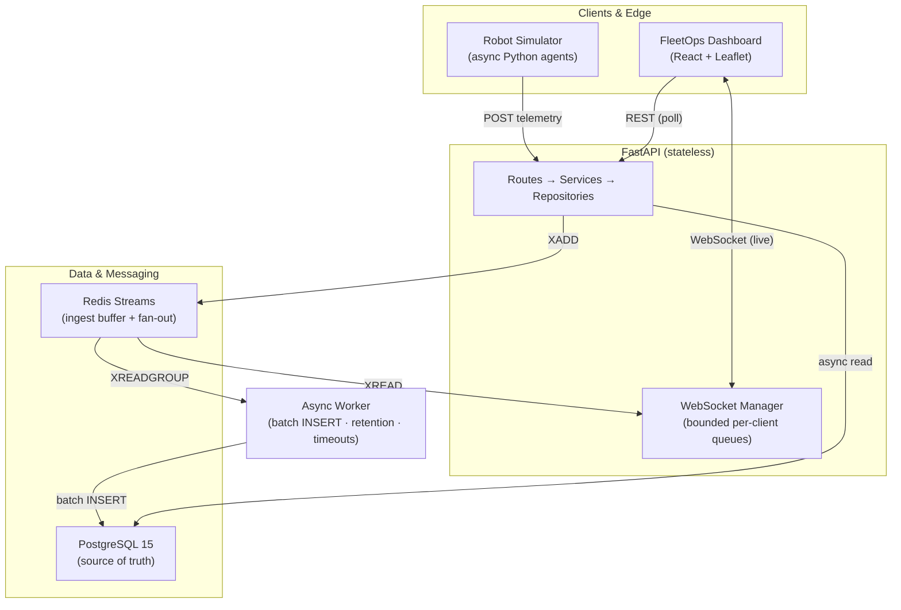

<div align="center">
  <h1>🤖 Robot Fleet Telemetry Platform</h1>
  <p><strong>A distributed, event-driven system for real-time ingestion, monitoring, and control of a robot fleet.</strong></p>

  [](https://github.com/colin-110/robot-fleet-platform/actions)
  [](https://python.org)
  [](https://fastapi.tiangolo.com/)
  [](https://reactjs.org/)
  [](https://postgresql.org/)
  [](https://redis.io/)
  [](https://docker.com/)
  [](https://aws.amazon.com/)

  ### 🔗 [**Live Demo**](https://d14zlr0p01xdp8.cloudfront.net) &nbsp;·&nbsp; [Report a Bug](https://github.com/colin-110/robot-fleet-platform/issues)

</div>

---

## 📖 Table of Contents

1. [What It Is](#-what-it-is)
2. [Key Features](#-key-features)
3. [Tech Stack](#-tech-stack)
4. [Architecture](#-architecture)
5. [Engineering Highlights](#-engineering-highlights)
6. [Testing & Quality](#-testing--quality)
7. [Performance Benchmarks](#-performance-benchmarks)
8. [Running It Locally](#-running-it-locally)
9. [Deployment (AWS)](#-deployment-aws)
10. [Limitations & Known Issues](#-limitations--known-issues-honest-section)
11. [Scaling Roadmap](#-scaling-roadmap-how-id-take-it-further)
12. [Repository Structure](#-repository-structure)

---

## 🎯 What It Is

The **Robot Fleet Telemetry Platform** simulates and monitors a fleet of autonomous robots in real time. Each robot streams high-frequency telemetry — battery, temperature, speed, GPS position, component health, and mission progress — into a backend that ingests it, derives live fleet state, and pushes updates to an operator dashboard over WebSockets. Operators can also **send commands** back to individual robots (Return to Base, Emergency Stop, Resume).

It was built to demonstrate **event-driven, asynchronous system design** end to end: high-velocity ingestion, decoupled processing, real-time fan-out, an idempotent command protocol, containerization, CI/CD, and a live cloud deployment.

> **In one sentence:** a full-stack, real-time IoT/robotics telemetry system with a decoupled ingestion pipeline (Redis Streams → async worker → PostgreSQL) and a live React operations console.

---

## ✨ Key Features

- **Real-time dashboard** — live map (Leaflet), fleet KPIs, per-robot cards, status charts, and an event log, all updating over a throttled WebSocket feed.
- **Decoupled ingestion pipeline** — HTTP writes return immediately; a background worker batches them into PostgreSQL, so request latency is independent of DB I/O.
- **Bidirectional control** — operators dispatch commands to robots through an idempotent state machine with timeouts.
- **Physics-based simulator** — 40+ concurrent async agents with battery drain, thermal dynamics, motor wear, network blackouts, mission routing, and a geofenced restricted zone.
- **Observability** — Prometheus metrics, health checks, and Grafana dashboards.
- **Full CI/CD** — GitHub Actions runs tests + lint on every push and publishes versioned container images to GHCR.
- **Live on AWS** — deployed on the free tier behind CloudFront (HTTPS).

---

## 🛠 Tech Stack

| Layer | Technologies |
| :--- | :--- |
| **Frontend** | React 19, Vite, React-Leaflet, Recharts, native WebSocket, Axios |
| **Backend** | FastAPI (async), Uvicorn, SQLAlchemy 2.0 (async), Pydantic v2 |
| **Data & Messaging** | PostgreSQL 15, Redis 7 (Streams + consumer groups) |
| **Async Processing** | Dedicated Python worker (batch inserts, retention pruning, command timeouts) |
| **Observability** | Prometheus, Grafana |
| **Infra & CI/CD** | Docker & Docker Compose, GitHub Actions, GHCR, AWS (EC2, RDS, ElastiCache, CloudFront) |
| **Testing** | Pytest, pytest-asyncio, httpx, aiohttp load-testing harness |

---

## 🏗 Architecture

The system separates the **high-velocity write path** from the **read/query path**, with Redis Streams as the buffer that decouples them.


```mermaid
graph TB
  subgraph Clients["Clients & Edge"]
    SIM["Robot Simulator<br/>(async Python agents)"]
    DASH["FleetOps Dashboard<br/>(React + Leaflet)"]
  end

  subgraph API["FastAPI (stateless)"]
    ROUTES["Routes → Services → Repositories"]
    WS["WebSocket Manager<br/>(bounded per-client queues)"]
  end

  subgraph Data["Data & Messaging"]
    REDIS["Redis Streams<br/>(ingest buffer + fan-out)"]
    PG["PostgreSQL 15<br/>(source of truth)"]
  end

  WORKER["Async Worker<br/>(batch INSERT · retention · timeouts)"]

  SIM -->|"POST telemetry"| ROUTES
  DASH -->|"REST (poll)"| ROUTES
  DASH <-->|"WebSocket (live)"| WS
  ROUTES -->|"XADD"| REDIS
  REDIS -->|"XREADGROUP"| WORKER
  REDIS -->|"XREAD"| WS
  WORKER -->|"batch INSERT"| PG
  ROUTES -->|"async read"| PG
```

**Request flow:**
1. A robot `POST`s telemetry → FastAPI appends it to a Redis Stream (`XADD`) and returns `200` immediately.
2. The **worker** consumes the stream in micro-batches (`XREADGROUP` + consumer groups) and bulk-inserts into PostgreSQL.
3. In parallel, the **WebSocket manager** reads the same stream (`XREAD`) and fans each message out to connected dashboards.
4. The dashboard also polls REST endpoints (fleet status, analytics) that read from PostgreSQL, with a 10s Redis cache.

Because the API holds no per-request state, it is **horizontally scalable** — additional instances all drain the same shared Redis stream.

---

## 🔧 Engineering Highlights

**1. High-throughput asynchronous ingestion.** Synchronous DB writes are the classic bottleneck under high-concurrency ingest. Redis Streams act as a durable buffer: the HTTP path only does an `XADD`, and a decoupled worker batches the actual `INSERT`s. This keeps ingest latency flat and independent of disk I/O.

**2. Real-time fan-out that survives slow clients.** Every API instance reads the shared stream and pushes to its own WebSocket clients. Each connection has a **bounded outbound queue drained by a dedicated sender task**; when a client can't keep up, the oldest frames are dropped rather than stalling the broadcast loop or leaking memory. The React client coalesces updates into throttled 10 Hz commits so the UI stays smooth.

**3. Idempotent command dispatch.** Commands move through an explicit state machine (`PENDING → DISPATCHED → ACKNOWLEDGED → EXECUTING → COMPLETED`), with idempotency keys and an **atomic `UPDATE … WHERE status='PENDING'`** claim so concurrent pollers can't double-dispatch. Expired commands are swept to `TIMEOUT` under a distributed Redis lock.

---

## 🧪 Testing & Quality

Testing spans **unit, integration, API-contract, state-machine, and load** levels. Everything below is reproducible from the repo.

### Automated test suite (`pytest`, runs in CI against real PostgreSQL + Redis)

| Metric | Result |
| :--- | :--- |
| **Tests** | 24 (22 passing, 2 skipped) |
| **Line coverage** | **57%** overall |
| **Suite runtime** | ~12 s |

**What's tested:** telemetry ingestion & retrieval, fleet-status derivation, the full command lifecycle (valid transitions, terminal immutability, idempotency, timeouts, **concurrent-dispatch race**), analytics aggregation, and the worker's batch-parsing logic.

**Coverage is honest, not uniform** — the API/route/model/schema layer is well covered (routes 90–100%, schemas & models ~100%), while the long-running async infrastructure (WebSocket manager 25%, worker 38%) is exercised by the live system and load tests rather than unit tests. Closing that gap is listed under [Known Issues](#-limitations--known-issues-honest-section).

### CI/CD pipeline (GitHub Actions)

On every push / PR to `main`:
1. **`backend-test`** — pytest against a real Postgres + Redis service.
2. **`frontend-build`** — ESLint (0 errors) + production Vite build.
3. **`publish-images`** — builds & pushes versioned `backend` + `frontend` images to GHCR (on `main`).
4. **`deploy-aws`** — gated SSM-based rollout (opt-in).

### Load / performance testing

A dedicated async harness ([`scripts/stress_test.py`](./scripts/stress_test.py)) drives single & batch ingest, REST reads, and WebSocket fan-out across a concurrency sweep up to 2,000, plus a sustained mixed-load run. Results in [Performance Benchmarks](#-performance-benchmarks).

### Codebase size

| Component | Lines of code |
| :--- | :--- |
| Backend (FastAPI + worker) | ~2,300 |
| Frontend (React) | ~1,500 |
| Simulator | ~935 |

---

## 📊 Performance Benchmarks

Measured with [`scripts/stress_test.py`](./scripts/stress_test.py) against the full stack on a **single developer machine** (Docker Desktop / WSL2) while the simulator was also generating live traffic. These are a **single-node lower bound** — reproducible, not aspirational.

**Real-time WebSocket fan-out** — the headline result:

| Concurrent clients | Connection failures | Messages (10 s) | Throughput |
| :--- | :--- | :--- | :--- |
| 500 | 0 | 67,692 | ~6,800 msg/s |
| 1,500 | 0 | 171,331 | ~17,100 msg/s |
| **2,000** | **0–17** | **~152k–178k** | **~15,000–18,000 msg/s** |

Across repeated runs the fan-out tier sustained **2,000 concurrent clients at ~15,000–18,000 msg/s with >99% delivery** (0–17 dropped out of 2,000) — validating the bounded-queue design.

**HTTP ingest latency (single node):**

| Concurrency | Success | p50 | p99 |
| :--- | :--- | :--- | :--- |
| 1 | 100% | 8 ms | 16 ms |
| 10 | 100% | 62 ms | 63 ms |
| 50 | 100% | 219 ms | 375 ms |

A **30-second sustained mixed-load** run (ingest + status/analytics reads at concurrency 50) completed **~2,900–3,900 requests with 0 failures**, p50 ~380–410 ms across runs.

> **On variance:** all numbers are from a **single dev machine running the entire stack** (API, worker, DB, Redis, and the simulator) simultaneously, so results move with host load — a fresh machine reproduces the higher figures, a busy one the lower. The WebSocket tier is consistently strong; HTTP throughput is the honest single-node ceiling (see [Limitations](#-limitations--known-issues-honest-section)) and is exactly what horizontal scaling addresses.

---

## 🚀 Running It Locally

**Prerequisites:** Docker & Docker Compose.

```bash
git clone https://github.com/colin-110/robot-fleet-platform.git
cd robot-fleet-platform
cp backend/.env.example backend/.env   # then set a DB password + API key
docker compose up --build -d
```

| Service | URL |
| :--- | :--- |
| **Dashboard** | http://localhost |
| **API docs (Swagger)** | http://localhost:8000/docs |
| **Prometheus** | http://localhost:9090 |
| **Grafana** | http://localhost:3000 (admin/admin) |

Run the load test:
```bash
pip install aiohttp
python scripts/stress_test.py --base-url http://localhost:8000
```

---

## ☁️ Deployment (AWS)

**Live now (free tier):** a single `t3.micro` EC2 runs the whole stack via Docker Compose, backed by managed **Amazon RDS (PostgreSQL)** + **ElastiCache (Redis)**, and fronted by **CloudFront** for HTTPS. On boot the instance pulls the repo and self-deploys (backend, worker, nginx frontend, simulator); nginx serves the SPA and proxies REST/WebSocket to the backend. GitHub Actions publishes container images to GHCR on every push.

```
Viewer ──HTTPS──▶ CloudFront ──HTTP──▶ EC2 (nginx :80 → FastAPI :8000)
                                          ├──▶ Amazon RDS (PostgreSQL)
                                          └──▶ Amazon ElastiCache (Redis)
```

> This is the cost-optimized single-node topology. The multi-node HA version (ALB + Auto Scaling Group + Multi-AZ RDS) is described under the [Scaling Roadmap](#-scaling-roadmap-how-id-take-it-further) — the code is already stateless and ready for it.

---

## ⚠️ Limitations & Known Issues (honest section)

I'd rather be upfront about where this stands than oversell it.

| Area | Limitation | Impact |
| :--- | :--- | :--- |
| **HTTP throughput** | Single-node synchronous ingest plateaus at ~125–250 req/s; beyond ~500 concurrent requests, latency climbs and the node sheds load (HTTP 500s at 1.5k–2k). | The Redis buffer helps, but the FastAPI request path is the ceiling. Solved by horizontal scaling. |
| **No HA in the live deploy** | One EC2, single-AZ RDS, one Redis node. | Fine for a demo; a node/AZ failure means downtime. |
| **Authentication** | A single shared API key, which is baked into the frontend bundle (client-visible). | Acceptable for a demo; **not** production-grade. No per-user auth or multi-tenancy. |
| **Time-series storage** | Telemetry lives in a plain PostgreSQL table (bounded by a daily retention pruner). | Works, but not ideal for high-volume time-series at scale. |
| **Test coverage gaps** | Async worker & WebSocket manager are ~25–38% unit-covered. | Verified via the live system + load tests, but deserves dedicated async tests. |
| **CloudFront origin** | Pinned to the current EC2's DNS name. | If the instance is replaced, the origin needs a one-line update. |
| **Simulator in prod** | The live deploy runs the simulator to generate demo data. | A convenience for the demo; a real system ingests from actual devices. |

---

## 📈 Scaling Roadmap (how I'd take it further)

If this needed to handle a genuinely large fleet, in priority order:

1. **Scale the API horizontally.** The tier is already stateless. Put it behind an ALB in an Auto Scaling Group; every instance drains the same shared Redis stream, so ingest and fan-out capacity grow ~linearly with node count. This is the single biggest win and the code supports it today.
2. **Partition the telemetry table** (native PostgreSQL partitioning or **TimescaleDB**). Retention becomes an instant `DROP PARTITION` instead of a batched `DELETE`, and time-range queries get dramatically cheaper.
3. **Swap Redis Streams for Kafka** if throughput reaches millions/sec or multiple independent consumer groups + long replay windows are needed.
4. **Real auth & multi-tenancy** — JWT/OIDC, per-fleet isolation, per-key rate limiting.
5. **Managed HA data tier** — Multi-AZ RDS with read replicas + PgBouncer for the read path; a clustered/replicated Redis.
6. **Dedicated realtime gateway** — move WebSocket fan-out to its own horizontally-scaled tier (or a managed service) so it scales independently of the ingest API.
7. **Deeper observability** — distributed tracing (OpenTelemetry) across the ingest → worker → DB path, plus alerting on the existing Prometheus metrics.

---

## 📂 Repository Structure

| Path | Description |
| :--- | :--- |
| [`/backend`](./backend) | FastAPI app (routes → services → repositories), SQLAlchemy async models, and the decoupled Redis→Postgres worker. |
| [`/frontend/robot-fleet-dashboard`](./frontend/robot-fleet-dashboard) | React 19 + Vite dashboard (Leaflet map, Recharts, WebSocket hooks), served by nginx. |
| [`/simulator`](./simulator) | Async Python simulator: physics-based robot agents (battery, thermal, wear, blackouts, missions). |
| [`/scripts`](./scripts) | Async load-testing harness (`stress_test.py`). |
| [`/.github/workflows`](./.github/workflows) | CI/CD pipeline. |

---

## 📜 License

MIT — see [LICENSE](./LICENSE).
