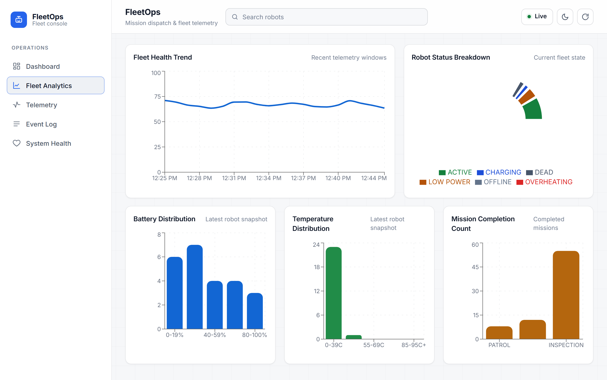
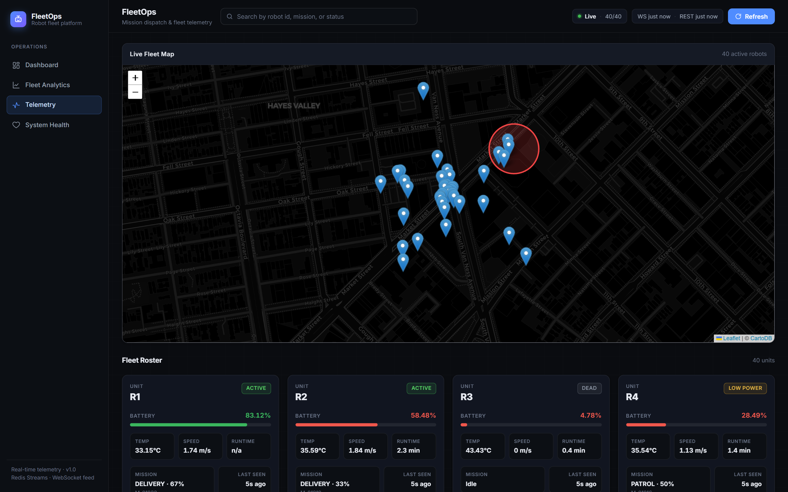
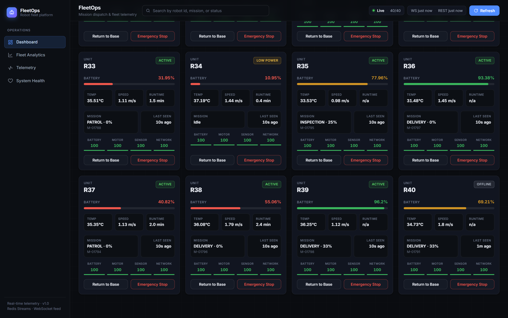

<div align="center">

# Real-Time Robot Fleet Monitoring and Control Platform

**A distributed, event-driven system for real-time telemetry ingestion, live monitoring, and bidirectional control of a robot fleet.**

[](https://github.com/colin-110/robot-fleet-platform/actions)
[](https://python.org)
[](https://fastapi.tiangolo.com/)
[](https://reactjs.org/)
[](https://postgresql.org/)
[](https://redis.io/)
[](https://docker.com/)
[](https://aws.amazon.com/)
[](./LICENSE)

**[Live Demo](https://d14zlr0p01xdp8.cloudfront.net)** · [Report an Issue](https://github.com/colin-110/robot-fleet-platform/issues)


</div>

---

## Contents

1. [Overview](#overview)
2. [Key Features](#key-features)
3. [Technology Stack](#technology-stack)
4. [Architecture](#architecture)
5. [Engineering Highlights](#engineering-highlights)
6. [Performance](#performance)
7. [Testing and Quality](#testing-and-quality)
8. [Running Locally](#running-locally)
9. [Configuration](#configuration)
10. [Deployment](#deployment)
11. [Security Posture](#security-posture)
12. [Limitations and Known Issues](#limitations-and-known-issues)
13. [Scaling Roadmap](#scaling-roadmap)
14. [Repository Structure](#repository-structure)
15. [License](#license)

---

## Overview

This platform simulates, monitors, and controls a fleet of autonomous robots in real time. Each robot streams high-frequency telemetry — battery, temperature, speed, position, per-component health, and mission progress — into a backend that ingests it, derives live fleet state, and pushes updates to an operator dashboard over WebSockets. Operators can dispatch commands back to individual robots (Return to Base, Emergency Stop, Resume) through an idempotent state machine.

It was built to demonstrate event-driven asynchronous system design end to end: high-velocity ingestion, decoupled processing, real-time fan-out to many concurrent clients, an idempotent command protocol, containerization, CI/CD, and a live cloud deployment.

> **In one sentence:** a full-stack real-time IoT/robotics telemetry system with a decoupled ingestion pipeline (Redis Streams to async worker to PostgreSQL) and a live React operations console.

### Screenshots

| Fleet analytics: trends, distributions, mission statistics | Live fleet map: geospatial tracking and geofence |
| :---: | :---: |
|  |  |
| **Fleet roster: per-unit telemetry and controls** | **Real-time status panels and event log** |
|  |  |

---

## Key Features

- **Real-time operations dashboard.** Live map (Leaflet), fleet KPIs, per-robot cards, status charts, and an event log, all driven by a throttled WebSocket feed.
- **Decoupled ingestion pipeline.** HTTP writes return immediately after a single Redis `XADD`; a separate worker process batches them into PostgreSQL, so request latency is independent of database I/O.
- **Bidirectional control.** Operators dispatch commands through an explicit state machine with idempotency keys, timeouts, and atomic compare-and-set transitions.
- **Physics-based simulator.** Forty concurrent async agents modelling battery drain, thermal dynamics, motor wear, network blackouts, mission routing, and a geofenced restricted zone.
- **Observability.** Prometheus metrics (multiprocess-aware), health checks, and Grafana dashboards.
- **Measured optimizations.** Every performance optimization sits behind a feature flag, with a benchmark harness that measures each one in isolation against the naive implementation it replaced.
- **Continuous integration and delivery.** GitHub Actions runs blocking lint and a full test suite against real PostgreSQL and Redis, then publishes versioned container images to GHCR.
- **Live on AWS.** Deployed on the free tier behind CloudFront over HTTPS.

---

## Technology Stack

| Layer | Technologies |
| :--- | :--- |
| Frontend | React 19, Vite, React-Leaflet, Recharts, native WebSocket, Axios |
| Backend | FastAPI (async), Uvicorn, SQLAlchemy 2.0 (async), Pydantic v2 |
| Data and messaging | PostgreSQL 15, Redis 7 (Streams with consumer groups) |
| Async processing | Dedicated Python worker (batch inserts, retention pruning, command timeouts) |
| Observability | Prometheus, Grafana |
| Infrastructure and CI/CD | Docker, Docker Compose, GitHub Actions, GHCR, AWS (EC2, RDS, ElastiCache, CloudFront) |
| Testing and tooling | Pytest, pytest-asyncio, httpx, Ruff, aiohttp load-testing harness |

---

## Architecture

The system separates the high-velocity write path from the read and query path, with Redis Streams as the buffer that decouples them.


```mermaid
graph TB
  subgraph Clients["Clients and Edge"]
    SIM["Robot Simulator<br/>(async Python agents)"]
    DASH["Operations Dashboard<br/>(React + Leaflet)"]
  end

  subgraph API["FastAPI (stateless)"]
    ROUTES["Routes -> Services -> Repositories"]
    WS["WebSocket Manager<br/>(bounded per-client queues)"]
  end

  subgraph Data["Data and Messaging"]
    REDIS["Redis Streams<br/>(ingest buffer + fan-out)"]
    PG["PostgreSQL 15<br/>(source of truth)"]
  end

  WORKER["Async Worker<br/>(batch INSERT, retention, timeouts)"]

  SIM -->|"POST telemetry"| ROUTES
  DASH -->|"REST (poll)"| ROUTES
  DASH <-->|"WebSocket (live)"| WS
  ROUTES -->|"XADD"| REDIS
  REDIS -->|"XREADGROUP"| WORKER
  REDIS -->|"XREAD"| WS
  WORKER -->|"batch INSERT"| PG
  ROUTES -->|"async read"| PG
```

**Request flow**

1. A robot `POST`s telemetry. FastAPI appends it to a Redis Stream (`XADD`) and returns `200` immediately.
2. The worker consumes the stream in micro-batches (`XREADGROUP` with consumer groups) and bulk-inserts into PostgreSQL.
3. In parallel, the WebSocket manager reads the same stream (`XREAD`) and fans each message out to connected dashboards.
4. The dashboard also polls REST endpoints (fleet status, analytics) that read from PostgreSQL behind a 10-second Redis cache.

The two Redis read modes are deliberate. The worker path uses `XREADGROUP` so that consumer-group members split the stream between them and each row is persisted exactly once. The fan-out path uses `XREAD` so that every API instance receives every message and can forward it to its own connected clients. Because the API holds no per-request state, it scales horizontally: additional instances all attach to the same shared stream.

---

## Engineering Highlights

**High-throughput asynchronous ingestion.** Synchronous database writes are the classic bottleneck under high-concurrency ingest. Redis Streams act as a durable buffer: the HTTP path only performs an `XADD`, and a decoupled worker batches the actual `INSERT`s. Measured effect: p99 ingest latency fell from 1,271 ms to 158 ms at concurrency 50.

**Real-time fan-out that survives slow clients.** Every connection has a bounded outbound queue drained by a single dedicated sender task. Broadcasting is a non-blocking put onto every client's queue, so it never awaits a slow socket and never spawns a task per message. When a client cannot keep up, the *oldest* buffered frame is dropped rather than the newest, because stale telemetry is worthless — a robot's position from three seconds ago is noise. This caps memory per connection and prevents one stalled client from back-pressuring the entire fleet. Measured effect: 140 percent higher throughput than a task-per-message implementation at 300 concurrent clients.

**A roster, so absence is detectable.** Fleet status is the robot roster LEFT JOINed onto recent telemetry, not a `GROUP BY` over recent telemetry. The distinction is the difference between a working monitor and a broken one: deriving the fleet from telemetry alone means a robot that stops reporting eventually falls outside the query window and silently disappears from the dashboard, so a unit that died an hour ago is indistinguishable from one that never existed. Registered robots are always listed, and missing telemetry renders `OFFLINE` with the roster's last-seen time. The roster populates itself — the worker upserts it as it persists each batch, keeping the write off the request path.

**Device-reported timestamps.** A reading carries when the *device* measured it, not when the server received it. This is what makes store-and-forward possible: a robot that buffers readings through a network outage can upload them with their real times instead of collapsing an entire outage onto one instant. Future-dated readings beyond a configurable skew are clamped, since a device with a fast clock would otherwise sit permanently at the head of "most recent" and make a dead robot look alive.

**Idempotent command dispatch with compare-and-set transitions.** Commands move through an explicit state machine (`PENDING` to `DISPATCHED` to `ACKNOWLEDGED` to `EXECUTING` to `COMPLETED`). Both claiming a command and advancing its status are performed as a single conditional `UPDATE ... WHERE status = :expected`, so when two pollers or two status updates race, exactly one matches a row and the loser receives a `409`. Doing the validation in application code and writing afterwards would allow both writers to observe the same state and both commit. Expired commands are swept to `TIMEOUT` under a distributed Redis lock.

**Multiprocess-correct metrics.** The API runs under `uvicorn --workers 4`, which forks independent processes. `prometheus_client` keeps its registry in process memory, so a naive setup serves `/metrics` from whichever worker answers the scrape and reports roughly a quarter of reality. The application uses the library's multiprocess mode, with a shared mmap directory and a `livesum` gauge aggregation so connection counts sum across live workers.

---

## Performance

All figures below were measured on a single developer machine running the entire stack (API, worker, PostgreSQL, Redis, and the simulator) simultaneously. They are a reproducible single-node lower bound, not an aspirational target.

### A/B optimization benchmarks

Every optimization sits behind an `OPT_*` flag whose "off" state restores the implementation it replaced. [`scripts/benchmark_matrix.py`](./scripts/benchmark_matrix.py) uses this to measure each optimization **in isolation**: it restarts the affected services with the flag off, runs a workload, restarts with the flag on, runs the identical workload, and reports the delta.

| Optimization | Baseline it replaces | Metric | Baseline | Optimized | Change |
| :--- | :--- | :--- | ---: | ---: | ---: |
| Redis read-through cache (fleet status) | Recompute window-function query per request | p99 | 11,172 ms | 265 ms | **-97.6%** |
| Redis cache (analytics aggregation) | Recompute all aggregations per request | p99 | 2,169 ms | 165 ms | **-92.4%** |
| Redis Stream ingest buffer | Synchronous `INSERT` on the request path | p99 | 1,271 ms | 158 ms | **-87.6%** |
| Pure ASGI middleware | Starlette `BaseHTTPMiddleware` | p99 | 176 ms | 89 ms | **-49.5%** |
| orjson serialization | stdlib `json` | p99 | 224 ms | 184 ms | **-17.9%** |
| Worker bulk `INSERT` | One `INSERT` + `COMMIT` per row | throughput | 242 rows/s | 985 rows/s | **+308%** |
| Bounded-queue WebSocket fan-out | `create_task` per client per message | throughput | 5,977 msg/s | 14,352 msg/s | **+140%** |

Three interleaved rounds per experiment, zero failed requests. Full detail, per-run spread, and methodology in [`docs/benchmarks.md`](./docs/benchmarks.md), with machine-readable results in `benchmarks.json`.

```bash
python scripts/benchmark_matrix.py --repeats 3
```

**Methodology.** Measuring "everything on" against "everything off" shows that a stack got faster but not which change did it, so the harness isolates one variable per experiment. Arms are interleaved (off, on, off, on) so background load on the host biases both equally. Each configuration is warmed up before measurement, and the reported figure is the median of N runs with the full per-run spread printed alongside. Before each run the harness reads `/health` and asserts the flags actually came up as requested, because a restart that silently kept the previous configuration would produce a meaningless zero-percent delta that looks like a real result. Read-path experiments re-seed a fixed dataset first, so results do not depend on what a previous experiment left in the table. Any arm where more than five percent of requests failed is rejected rather than reported, because the p99 of zero successful requests is `0.0`, which otherwise reads as infinitely fast.

> **On measurement error.** Two of these experiments initially reported wrong numbers, which is worth recording because it is precisely the failure mode this harness exists to catch. The bulk-`INSERT` experiment first reported +1.1 percent: it was timing the HTTP request, but with the Redis buffer enabled that request only performs an `XADD`, so both arms were running identical code. It now measures worker drain throughput instead. The analytics-cache experiment first reported +0.0 percent because every request had failed and the p99 of an empty sample is zero. The harness now fails loudly on that second class of error rather than reporting it.

### Load and stress testing

A separate harness ([`scripts/stress_test.py`](./scripts/stress_test.py)) drives single and batch ingest, REST reads, and WebSocket fan-out across a concurrency sweep up to 2,000, plus a sustained mixed-load run.

**WebSocket fan-out**

| Concurrent clients | Connection failures | Messages (10 s) | Throughput |
| :--- | :--- | :--- | :--- |
| 500 | 0 | 67,692 | ~6,800 msg/s |
| 1,500 | 0 | 171,331 | ~17,100 msg/s |
| **2,000** | **0–17** | **~152k–178k** | **~15,000–18,000 msg/s** |

Across repeated runs the fan-out tier sustained 2,000 concurrent clients at 15,000 to 18,000 msg/s with greater than 99 percent delivery, which validates the bounded-queue design.

**HTTP ingest latency (single node)**

| Concurrency | Success | p50 | p99 |
| :--- | :--- | :--- | :--- |
| 1 | 100% | 8 ms | 16 ms |
| 10 | 100% | 62 ms | 63 ms |
| 50 | 100% | 219 ms | 375 ms |

A 30-second sustained mixed-load run (ingest plus status and analytics reads at concurrency 50) completed roughly 2,900 to 3,900 requests with zero failures, at p50 380 to 410 ms.

> **On variance.** Because a single machine hosts the whole stack, results move with host load: a quiet machine reproduces the higher figures and a busy one the lower. The WebSocket tier is consistently strong. HTTP throughput is the honest single-node ceiling and is exactly what horizontal scaling addresses.

---

## Testing and Quality

Testing spans unit, integration, API-contract, state-machine, concurrency, and load levels. Everything below is reproducible from the repository.

### Automated test suite

| Metric | Result |
| :--- | :--- |
| Tests | 28 passing, 0 skipped |
| Line coverage | 62% overall |
| Suite runtime | ~13 s |
| Database | Real PostgreSQL, in CI and locally |

The suite runs against real PostgreSQL rather than SQLite because the application depends on Postgres-specific SQL — `date_trunc`, `INTERVAL` arithmetic, and atomic conditional `UPDATE` dispatch — that SQLite cannot execute. A safety guard refuses to run against any database whose name does not contain `test`, since the fixtures drop and recreate the schema between tests.

**What is covered:** telemetry ingestion and retrieval; fleet-status derivation; the full command lifecycle including valid transitions, terminal-state immutability, idempotency keys, timeouts, concurrent dispatch, and concurrent status updates (two racing `PATCH` requests must not both commit); analytics aggregation against real Postgres SQL; cache hit and cache-bypass behaviour; and the worker's batch-parsing logic.

**Coverage is honest rather than uniform.** Schemas are at 100 percent and most routes are 91 to 100 percent, while the long-running async infrastructure is thinner: the WebSocket manager sits at 26 percent and the worker at 39 percent. Their pure logic is unit-tested; the surrounding infinite loops are exercised by the live system and the load harness instead. Closing that gap is listed under [Limitations](#limitations-and-known-issues).

### Continuous integration

On every push and pull request to `main`:

1. **`backend-test`** — `ruff check` across `backend/`, `scripts/`, and `simulator/`, plus `ruff format --check`. Both are blocking. Then pytest with coverage against real PostgreSQL and Redis service containers.
2. **`frontend-build`** — ESLint (zero errors, zero warnings) and a production Vite build.
3. **`publish-images`** — builds and pushes versioned `backend` and `frontend` images to GHCR on `main`.
4. **`deploy-aws`** — gated SSM-based rollout, opt-in via a repository variable.

### Codebase size

| Component | Lines (non-blank) |
| :--- | ---: |
| Backend (FastAPI, services, worker) | 2,336 |
| Frontend (React) | 1,875 |
| Test suite | 645 |
| Simulator | 805 |
| Load and benchmark harnesses | 1,446 |

---

## Running Locally

**Prerequisites:** Docker and Docker Compose.

```bash
git clone https://github.com/colin-110/robot-fleet-platform.git
cd robot-fleet-platform
cp backend/.env.example backend/.env
```

Set a database password and an API key in `backend/.env`. The application refuses to start without `TELEMETRY_API_KEY`, deliberately — there is no fallback default. Generate one with:

```bash
python -c "import secrets; print(secrets.token_urlsafe(32))"
```

Then bring up the stack:

```bash
docker compose up --build -d
```

| Service | URL |
| :--- | :--- |
| Dashboard | http://localhost |
| API documentation (Swagger) | http://localhost:8000/docs |
| Prometheus | http://localhost:9090 |
| Grafana | http://localhost:3000 (admin/admin) |

**Run the test suite:**

```bash
cd backend && pytest tests/ -v --cov=app
```

**Run the load test:**

```bash
export TELEMETRY_API_KEY=$(grep TELEMETRY_API_KEY backend/.env | cut -d= -f2)
python scripts/stress_test.py --base-url http://localhost:8000
```

---

## Configuration

All settings are environment variables, loaded and validated by `pydantic-settings` at startup. See [`backend/.env.example`](./backend/.env.example) for the full list.

### Operational settings

| Variable | Default | Purpose |
| :--- | :--- | :--- |
| `DATABASE_URL` | *required* | PostgreSQL connection string |
| `REDIS_URL` | `redis://localhost:6379/0` | Redis connection string |
| `TELEMETRY_API_KEY` | *required* | Shared key for the `X-API-Key` header and the WebSocket handshake |
| `APP_ENV` | `development` | `production` additionally rejects wildcard CORS and API keys shorter than 16 characters |
| `CORS_ORIGINS` | localhost origins | Comma-separated allowed origins |
| `TRUSTED_PROXY_COUNT` | `0` | Number of reverse proxies in front of the app; controls how the rate limiter resolves the client IP |
| `RATE_LIMIT_PER_MINUTE` | `600` | Ingest requests permitted per client per minute |
| `REQUIRE_AUTH_FOR_READS` | `false` | Whether fleet status, analytics, and events require an API key |
| `OFFLINE_AFTER_SECONDS` | `60` | Seconds of silence before a robot is reported OFFLINE |
| `FLEET_WINDOW_MINUTES` | `15` | How far back fleet status scans for telemetry |
| `MAX_CLOCK_SKEW_SECONDS` | `300` | Future-dated device timestamps beyond this are clamped to server time |
| `TELEMETRY_STREAM_MAXLEN` | `100000` | Entries retained in the ingest stream; the worker's catch-up headroom |
| `PROMETHEUS_MULTIPROC_DIR` | unset | Required when running more than one Uvicorn worker |

### Optimization flags

Each flag defaults to enabled. Setting one to `false` restores the naive implementation it replaced, which is how the benchmark harness measures its individual contribution.

| Flag | Enabled | Disabled |
| :--- | :--- | :--- |
| `OPT_REDIS_BUFFER` | `XADD` to a Redis Stream, worker persists | Synchronous `INSERT` on the request path |
| `OPT_READ_CACHE` | Redis read-through cache, 10 s TTL | Recompute the aggregation per request |
| `OPT_ASGI_MIDDLEWARE` | Pure ASGI middleware | Starlette `BaseHTTPMiddleware` |
| `OPT_ORJSON` | orjson response serialization | stdlib `json` |
| `OPT_BOUNDED_FANOUT` | Bounded per-client queue and sender task | `create_task` per client per message |
| `OPT_BATCH_INSERT` | One multi-row `INSERT` per batch | One `INSERT` and `COMMIT` per row |

---

## Deployment

A single `t3.micro` EC2 instance runs the whole stack via Docker Compose, backed by managed Amazon RDS (PostgreSQL) and ElastiCache (Redis), fronted by CloudFront for HTTPS. On boot the instance pulls the repository and self-deploys the backend, worker, nginx frontend, and simulator. Nginx serves the single-page application and proxies REST and WebSocket traffic to the backend. GitHub Actions publishes container images to GHCR on every push to `main`.

```
Viewer --HTTPS--> CloudFront --HTTP--> EC2 (nginx :80 -> FastAPI :8000)
                                          |--> Amazon RDS (PostgreSQL)
                                          '--> Amazon ElastiCache (Redis)
```

This is the cost-optimized single-node topology. The multi-node high-availability version (ALB, Auto Scaling Group, Multi-AZ RDS) is described under [Scaling Roadmap](#scaling-roadmap); the application tier is already stateless and ready for it.

The production compose file refuses to start without an explicit `CORS_ORIGINS` value, and sets `TRUSTED_PROXY_COUNT=2` to account for nginx and CloudFront.

---

## Security Posture

| Control | Implementation |
| :--- | :--- |
| API key comparison | `secrets.compare_digest`. A plain `!=` short-circuits at the first differing byte, leaking key prefixes through response timing. |
| Secret defaults | None. `TELEMETRY_API_KEY` has no fallback value; the application fails at startup if it is missing. |
| Production guards | `APP_ENV=production` rejects wildcard CORS origins and API keys shorter than 16 characters at configuration load. |
| CORS | Credentials are dropped automatically when the origin list is a wildcard, since the specification forbids that combination and browsers reject the response. |
| Client IP resolution | The rate limiter reads `X-Forwarded-For` using a configured trusted-proxy count, taking the Nth entry from the right. Trusting the leftmost entry would let a client spoof its own address; trusting the socket peer would collapse the entire fleet into one bucket behind a proxy. |
| Rate limiting | Redis sorted-set sliding window on ingest endpoints. Fails open, so a Redis outage degrades rate limiting rather than halting ingestion. |
| State transitions | Atomic compare-and-set `UPDATE` statements, so concurrent writers cannot both commit a transition. |
| Read endpoints | Fleet status, analytics, and events are public by default so the hosted demo works without shipping a key to every browser. This is a setting (`REQUIRE_AUTH_FOR_READS`), not a hardcoded exemption; it is the wrong default for real fleet positions. |
| Secret hygiene | `.env`, `*.pem`, `*.key`, and `*.tfvars` are gitignored; the load-test harness reads its key from the environment rather than a literal. |

---

## Limitations and Known Issues

Being direct about where this stands is more useful than overselling it.

| Area | Limitation | Impact |
| :--- | :--- | :--- |
| HTTP throughput | Single-node ingest plateaus around 125 to 250 req/s. Beyond roughly 500 concurrent requests, latency climbs and the node sheds load. | The Redis buffer helps substantially, but the FastAPI request path remains the ceiling. Addressed by horizontal scaling. |
| Authentication | A single shared API key. It is compared in constant time and required at startup, but the dashboard still ships it in the frontend bundle, so it is visible to any client. | Acceptable for a demonstration, not production-grade. No per-user authentication or multi-tenancy. Fixing this properly means moving the WebSocket handshake behind a short-lived signed token. |
| No high availability | One EC2 instance, single-AZ RDS, one Redis node. | Adequate for a demo; a node or AZ failure means downtime. |
| Time-series storage | Telemetry lives in a plain PostgreSQL table, bounded by a daily retention pruner. | Works, but not ideal for high-volume time-series at scale. |
| Ingest buffer is bounded | The Redis Stream is capped (default 100,000 entries) and Redis trims the oldest beyond that, including entries the worker has not yet acknowledged. It is catch-up headroom, not an unbounded durable log. | A worker offline long enough to exhaust the buffer loses telemetry. Made visible rather than silent: `telemetry_stream_length` and `telemetry_stream_pending` are exported, and the worker warns at 90 percent. A durable fix means a dead-letter path or a broker with disk-backed retention. |
| Test coverage gaps | The worker's main loop and the WebSocket manager's listener are thinly covered (39 and 26 percent). Their pure logic is tested; the surrounding infinite loops are not. | Verified through the live system and load tests, but deserves dedicated async tests. |
| Metrics under multiple workers | Now correct, but worth recording that it was silently wrong: `prometheus_client` keeps counters per process, so with four workers the `/metrics` scrape reported roughly a quarter of reality. | Fixed via multiprocess mode. The failure mode is silent, so `PROMETHEUS_MULTIPROC_DIR` must be set wherever the app runs with more than one worker. |
| orjson benefit is narrow | Current FastAPI serializes directly through Pydantic whenever a route declares a `response_model`, bypassing the custom response class. | The measured 17.9 percent gain applies only to routes without a response model. Retained because measuring it is how that constraint was discovered. |
| CloudFront origin | Pinned to the current EC2 instance's DNS name. | If the instance is replaced, the origin needs a one-line update. |
| Simulator in production | The live deployment runs the simulator to generate demonstration data. | A convenience for the demo; a real system ingests from actual devices. |

---

## Scaling Roadmap

In priority order, if this needed to handle a genuinely large fleet:

1. **Scale the API horizontally.** The tier is already stateless. Place it behind an ALB in an Auto Scaling Group; every instance drains the same shared Redis stream, so ingest and fan-out capacity grow close to linearly with node count. This is the single largest win and the code supports it today.
2. **Partition the telemetry table**, using native PostgreSQL partitioning or TimescaleDB. Retention becomes an instant `DROP PARTITION` rather than a batched `DELETE`, and time-range queries get substantially cheaper.
3. **Replace Redis Streams with Kafka** if throughput reaches millions of messages per second, or if multiple independent consumer groups and long replay windows become necessary.
4. **Real authentication and multi-tenancy.** JWT or OIDC, per-fleet isolation, and per-key rate limiting.
5. **Managed high-availability data tier.** Multi-AZ RDS with read replicas and PgBouncer for the read path, plus a clustered or replicated Redis.
6. **Dedicated realtime gateway.** Move WebSocket fan-out to its own horizontally scaled tier so it scales independently of the ingest API.
7. **Deeper observability.** Distributed tracing (OpenTelemetry) across the ingest, worker, and database path, plus alerting on the existing Prometheus metrics.

---

## Repository Structure

| Path | Description |
| :--- | :--- |
| [`backend/`](./backend) | FastAPI application (routes, services, repositories), SQLAlchemy async models, Alembic migrations, and the decoupled Redis-to-PostgreSQL worker. |
| [`backend/tests/`](./backend/tests) | Pytest suite running against real PostgreSQL. |
| [`frontend/robot-fleet-dashboard/`](./frontend/robot-fleet-dashboard) | React 19 and Vite dashboard (Leaflet map, Recharts, WebSocket hooks), served by nginx. |
| [`simulator/`](./simulator) | Async Python simulator with physics-based robot agents. |
| [`scripts/`](./scripts) | Load-testing harness, A/B optimization benchmark, and deployment helpers. |
| [`docs/`](./docs) | Benchmark results and dashboard screenshots. |
| [`.github/workflows/`](./.github/workflows) | CI/CD pipeline. |

---

## License

MIT. See [LICENSE](./LICENSE).
