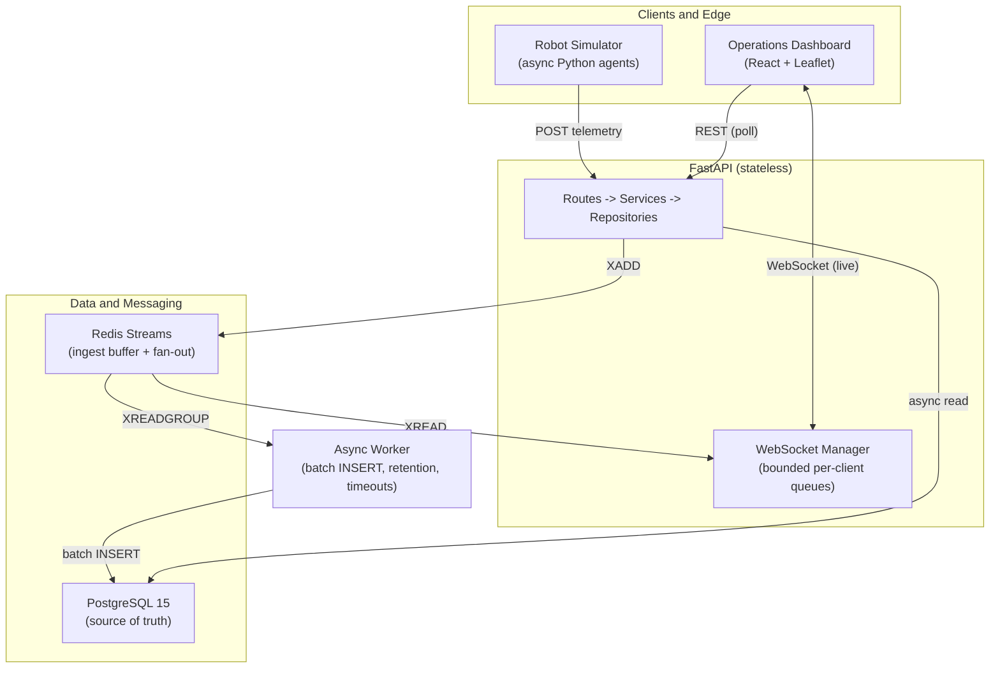

# Architecture

[← Back to README](../README.md)

The system separates the high-velocity write path from the read and query path, with Redis Streams as the buffer that decouples them.

## Request flow

1. A robot `POST`s telemetry. FastAPI appends it to a Redis Stream (`XADD`) and returns `200` immediately.
2. The worker consumes the stream in micro-batches (`XREADGROUP` with consumer groups) and bulk-inserts into PostgreSQL.
3. In parallel, the WebSocket manager reads the same stream (`XREAD`) and fans each message out to connected dashboards.
4. The dashboard also polls REST endpoints (fleet status, analytics) that read from PostgreSQL behind a 10-second Redis cache.

The two Redis read modes are deliberate. The worker path uses `XREADGROUP` so that consumer-group members split the stream between them and each row is persisted exactly once. The fan-out path uses `XREAD` so that every API instance receives every message and can forward it to its own connected clients. Because the API holds no per-request state, it scales horizontally: additional instances all attach to the same shared stream.

---

## Engineering highlights

**High-throughput asynchronous ingestion.** Synchronous database writes are the classic bottleneck under high-concurrency ingest. Redis Streams act as a durable buffer: the HTTP path only performs an `XADD`, and a decoupled worker batches the actual `INSERT`s. Measured effect: p99 ingest latency fell from 1,271 ms to 158 ms at concurrency 50.

**Real-time fan-out that survives slow clients.** Every connection has a bounded outbound queue drained by a single dedicated sender task. Broadcasting is a non-blocking put onto every client's queue, so it never awaits a slow socket and never spawns a task per message. When a client cannot keep up, the *oldest* buffered frame is dropped rather than the newest, because stale telemetry is worthless — a robot's position from three seconds ago is noise. This caps memory per connection and prevents one stalled client from back-pressuring the entire fleet. Measured effect: 140 percent higher throughput than a task-per-message implementation at 300 concurrent clients.

**A roster, so absence is detectable.** Fleet status is the robot roster LEFT JOINed onto recent telemetry, not a `GROUP BY` over recent telemetry. The distinction is the difference between a working monitor and a broken one: deriving the fleet from telemetry alone means a robot that stops reporting eventually falls outside the query window and silently disappears from the dashboard, so a unit that died an hour ago is indistinguishable from one that never existed. Registered robots are always listed, and missing telemetry renders `OFFLINE` with the roster's last-seen time. The roster populates itself — the worker upserts it as it persists each batch, keeping the write off the request path.

**Device-reported timestamps.** A reading carries when the *device* measured it, not when the server received it. This is what makes store-and-forward possible: a robot that buffers readings through a network outage can upload them with their real times instead of collapsing an entire outage onto one instant. Future-dated readings beyond a configurable skew are clamped, since a device with a fast clock would otherwise sit permanently at the head of "most recent" and make a dead robot look alive.

**Idempotent command dispatch with compare-and-set transitions.** Commands move through an explicit state machine (`PENDING` to `DISPATCHED` to `ACKNOWLEDGED` to `EXECUTING` to `COMPLETED`). Both claiming a command and advancing its status are performed as a single conditional `UPDATE ... WHERE status = :expected`, so when two pollers or two status updates race, exactly one matches a row and the loser receives a `409`. Doing the validation in application code and writing afterwards would allow both writers to observe the same state and both commit. Expired commands are swept to `TIMEOUT` under a distributed Redis lock.

**Multiprocess-correct metrics.** The API runs under `uvicorn --workers 4`, which forks independent processes. `prometheus_client` keeps its registry in process memory, so a naive setup serves `/metrics` from whichever worker answers the scrape and reports roughly a quarter of reality. The application uses the library's multiprocess mode, with a shared mmap directory and a `livesum` gauge aggregation so connection counts sum across live workers.

---

## Repository structure

| Path | Description |
| :--- | :--- |
| [`backend/`](../backend) | FastAPI application (routes, services, repositories), SQLAlchemy async models, Alembic migrations, and the decoupled Redis-to-PostgreSQL worker. |
| [`backend/tests/`](../backend/tests) | Pytest suite running against real PostgreSQL. |
| [`frontend/robot-fleet-dashboard/`](../frontend/robot-fleet-dashboard) | React 19 and Vite dashboard (Leaflet map, Recharts, WebSocket hooks), served by nginx. |
| [`simulator/`](../simulator) | Async Python simulator with physics-based robot agents. |
| [`scripts/`](../scripts) | Load-testing harness, A/B optimization benchmark, and deployment helpers. |
| [`docs/`](.) | Architecture, performance, operations, and generated benchmark results. |
| [`.github/workflows/`](../.github/workflows) | CI/CD pipeline. |
